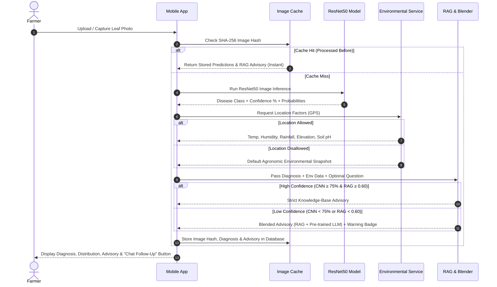

# 🌿 PlantIQ — Coffee Crop AI & Farmer Marketplace

**PlantIQ** is an end-to-end mobile application and AI backend designed for coffee farmers, agronomists, and buyers. It combines Computer Vision (CNN) for leaf disease diagnosis, Retrieval-Augmented Generation (RAG) for agronomic treatment advisories, a bilingual (English & Kannada) voice-enabled AI Chatbot, an Image Deduplication Cache, a modular Environmental Data API abstraction, and a Crop Marketplace with 1-tap Google Maps navigation.

---

## 🚀 Key Features

- **🌿 Computer Vision Disease Diagnosis (CNN)**: ResNet50 model detecting 5 coffee leaf conditions: *Miner*, *Rust*, *Phoma*, *Healthy*, and *Cercospora*.
- **🧠 Knowledge-Base RAG Advisory**: Ingests scientific agronomic PDFs into a FAISS vector store to synthesize tailored disease treatment, recovery, and prevention advisories using Gemini / Groq LLMs.
- **⚡ Image Deduplication Cache**: Computes SHA-256 hashes for uploaded leaf photos. Duplicate uploads hit the cache instantly, skipping redundant CNN inference and LLM API calls.
- **🛡️ Low-Confidence Knowledge Blending**: When CNN confidence (< 75%) or vector similarity (< 0.60) is low, the pipeline automatically activates **Blended Mode**—combining retrieved vector knowledge with general pre-trained LLM expertise while displaying a warning badge for farmer transparency.
- **💬 Bilingual Voice Chatbot (English & Kannada)**:
  - Multiturn conversation memory.
  - Speech-to-Text (STT) mic input & Text-to-Speech (TTS) audio answers in English (`en`) and Kannada (`kn`).
  - Image attachments inside chat with clear "Attached Image" state indicators.
  - 1-tap **Scan-to-Chat Handoff**: Jump directly from a leaf diagnosis screen into chat with context pre-loaded.
- **🌤️ Modular Environmental Data API**: Abstract `IEnvironmentalDataService` interface with `MockGeoWeatherProvider` querying Open-Meteo weather API based on GPS coordinates. Gracefully defaults when location access is disallowed.
- **🛒 Marketplace & 1-Tap Google Maps Navigation**: Farmers list crops for sale with prices and location coordinates. Buyers browse listings and launch Google Maps directly for 1-tap turn-by-turn navigation to coffee estates.

---

## 🏗️ System Architecture

```
                  ┌─────────────────────────────────────────┐
                  │          MOBILE CLIENT FRONTEND         │
                  │   (Scanner | Chatbot | Market | Cache)  │
                  └────────────────────┬────────────────────┘
                                       │ REST / JSON (HTTP)
                                       ▼
                  ┌─────────────────────────────────────────┐
                  │          FastAPI BACKEND GATEWAY        │
                  └────┬───────┬───────┬───────┬───────┬────┘
                       │       │       │       │       │
      ┌────────────────┘       │       │       │       └────────────────┐
      ▼                        ▼       ▼       ▼                        ▼
┌───────────────┐     ┌─────────────┐  ┌─────────────┐ ┌─────────────┐ ┌───────────────┐
│ ResNet50 CNN  │     │ RAG Engine  │  │ Chat Service│ │ Image Cache │ │  Marketplace  │
│ (PyTorch)     │     │(FAISS+Gemini│  │(EN/KN Speech│ │(SHA-256 Hash│ │  (SQLAlchemy) │
└───────────────┘     └──────┬──────┘  └──────┬──────┘ └─────────────┘ └───────────────┘
                             │                │
                             ▼                ▼
                      ┌──────────────────────────────┐
                      │ Environmental Data Service   │
                      │  (Abstract Weather Provider) │
                      └──────────────────────────────┘
```

---

## 🔄 Sequence Flows & Pipelines

### 1. CNN Scan & RAG Advisory Pipeline


### 2. Chatbot & CNN Handoff Pipeline
1. **Direct Handoff**: Tapping *"Ask Follow-Up in Chat"* transfers the diagnosis (`disease`, `confidence`, `advisory`, `image_hash`) to the chatbot module.
2. **Attached Image State**: User can attach a photo or leave it empty. The UI explicitly indicates `No image selected` or `Attached leaf image`.
3. **Voice Processing**: Uses Web Speech API for voice recording and speech synthesis in English and Kannada.

---

## 📁 Repository Structure

```
d:\end-capstone-project\
├── backend\                           # FastAPI Monolith Backend
│   ├── app\
│   │   ├── main.py                    # REST Gateway & Route Handler
│   │   ├── core\
│   │   │   ├── config.py              # Environment settings & thresholds
│   │   │   └── database.py            # SQLite / SQLAlchemy configuration
│   │   └── modules\
│   │       ├── cnn\                   # PyTorch ResNet50 Inference
│   │       │   └── detector.py
│   │       ├── rag\                   # FAISS Vector Store & LLM Engine
│   │       │   ├── vector_store.py
│   │       │   ├── pipeline.py
│   │       │   └── blender.py
│   │       ├── chat\                  # Multiturn Chatbot & Handoff Service
│   │       │   ├── chat_service.py
│   │       │   └── prompts.py
│   │       ├── cache\                 # SHA-256 Image Deduplication Cache
│   │       │   └── image_cache.py
│   │       ├── environment\           # Abstract Weather API Integration
│   │       │   ├── interface.py
│   │       │   └── mock_provider.py
│   │       ├── marketplace\           # Crop Listings & Google Maps Links
│   │       │   ├── models.py
│   │       │   ├── schemas.py
│   │       │   └── router.py
│   │       └── speech\                # i18n Translation & Speech Helpers
│   │           └── translator.py
│   ├── requirements.txt               # Backend Python Dependencies
│   └── run.py                         # Uvicorn Server Starter Script
├── mobile_app\                        # Mobile Application Client
│   ├── index.html                     # Responsive Mobile HTML Layout
│   ├── style.css                      # Glassmorphic Agronomy Design
│   └── app.js                         # Mobile App Logic & Speech API
├── cnn\                               # [READ-ONLY REFERENCE FOLDER]
├── rag\                               # [READ-ONLY REFERENCE FOLDER]
└── README.md
```

---

## 💻 Detailed Technology Stack

### **Backend Framework & Services**
- **API Server Gateway**: **FastAPI** + **Uvicorn** (Async Python 3.11 web framework).
- **Computer Vision (CNN)**: **PyTorch** & **Torchvision** with a pre-trained **ResNet50** backbone trained to classify 5 coffee leaf states (*Miner*, *Rust*, *Phoma*, *Healthy*, *Cerscospora*).
- **Vector Search & Ingestion**: **FAISS** (`IndexFlatIP`), **Sentence-Transformers** (`all-MiniLM-L6-v2`), and **PyMuPDF** for agronomic document indexing.
- **LLM Reasoning**: **Google Gemini API** (`gemini-1.5-flash`) with **Groq Llama-3.3** fallback.
- **Database & Storage**: **SQLite** + **SQLAlchemy ORM** (storing SHA-256 image cache hashes and marketplace crop listings).

### **Mobile Client Frontend**
- **Architecture**: Responsive Mobile **PWA (Progressive Web App)** built with HTML5, CSS3 (Glassmorphic Agronomy design system), and Vanilla JavaScript (ES6+).
- **Voice & i18n**: **Web Speech API** for English & Kannada Speech-to-Text (STT) mic input & Text-to-Speech (TTS) audio playback.
- **Location & Navigation**: Browser Geolocation API for GPS weather factors + 1-tap **Google Maps** deep-linking (`https://www.google.com/maps/search/?api=1&query={lat},{lng}`).

---

## 🛠️ How to Run the Project

### Prerequisites
- Python 3.10+ installed
- Google Gemini API Key (or Groq API Key)

### Step 1: Set Up Environment Variables
Create a `.env` file in the root or `backend/` directory:
```env
GEMINI_API_KEY=your_gemini_api_key_here
GROQ_API_KEY=your_groq_api_key_here
CONFIDENCE_THRESHOLD_CNN=75.0
CONFIDENCE_THRESHOLD_RAG=0.60
```

### Step 2: Install Backend Dependencies
Navigate to the `backend` folder and install requirements:
```bash
cd backend
pip install -r requirements.txt
```

### Step 3: Launch PlantIQ (Backend API + Mobile App UI)
Run the starter script:
```bash
python run.py
```
That's it! FastAPI will serve both the **Mobile App UI** and the **Backend REST API** on port `8000`.

---

## 📱 How to Open on Your Mobile Phone

1. **Connect to Same Wi-Fi**: Ensure your smartphone and computer are connected to the same Wi-Fi network.
2. **Find Your Computer's Wi-Fi IP**: Run `ipconfig` on Windows (look for `IPv4 Address`, e.g., `192.168.29.58`).
3. **Open on Phone Browser**:
   Open Chrome or Safari on your phone and navigate to:
   ```
   http://192.168.29.58:8000
   ```
4. **Add to Home Screen (PWA)**:
   Tap your phone browser menu and choose **"Add to Home Screen"** to launch PlantIQ as a fullscreen mobile application on your phone!

---

## 🔌 API Endpoints Reference

| Method | Endpoint | Description |
| :--- | :--- | :--- |
| `POST` | `/api/predict` | Runs image hash check -> ResNet50 CNN -> Env Weather -> RAG Advisory -> Cache Save |
| `POST` | `/api/chat/message` | Multiturn chatbot Q&A supporting EN/KN, voice, and image attachments |
| `POST` | `/api/chat/start-from-scan` | Pre-loads a new chat session with context handoff from a CNN scan |
| `GET` | `/api/marketplace/listings` | Retrieves crop listings formatted with 1-tap Google Maps deep links |
| `POST` | `/api/marketplace/listings` | Publishes a new farmer crop listing |
| `GET` | `/api/i18n/{lang}` | Fetches UI translation dictionary (`en` / `kn`) |

---

## 📜 License
Developed for the PlantIQ Capstone Project. All rights reserved.
