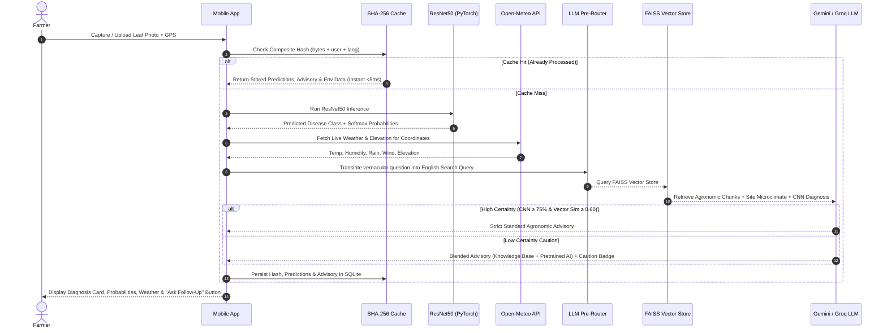
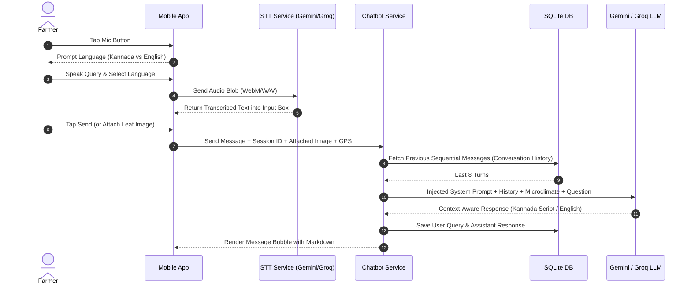

# 🌿 PlantIQ — Smart Coffee Agronomy & Farmer Marketplace

**PlantIQ** is an end-to-end precision agronomy platform and crop marketplace engineered specifically for coffee growers, agronomists, and buyers in the South Indian coffee belt (Chikmagalur, Kodagu, Hassan, Wayanad).

It integrates **Deep Learning Computer Vision (ResNet50)** for leaf disease classification, **Confidence-Aware Retrieval-Augmented Generation (RAG)** grounded in Central Coffee Research Institute (CCRI) manuals, a **Dynamic Multilingual Pre-Router** supporting English, Kannada (`ಕನ್ನಡ`), and Kanglish, an **Intelligent Voice Speech-to-Text Engine**, **Live Real-Time Open-Meteo Microclimate Data**, a **User-Scoped SHA-256 Deduplication Cache**, **Multi-Turn Conversational Chatbot Memory**, and a **Direct-to-Buyer Marketplace** with 1-tap Google Maps estate navigation.

---

## 📑 Table of Contents
- [Key Features & Innovations](#-key-features--innovations)
- [System Architecture](#-system-architecture)
- [Core Pipelines & Sequence Flows](#-core-pipelines--sequence-flows)
  - [1. Diagnostic & RAG Advisory Pipeline](#1-leaf-diagnostic--confidence-aware-rag-pipeline)
  - [2. Multilingual Voice & Chatbot Pipeline](#2-multilingual-voice--chatbot-memory-pipeline)
  - [3. Real-Time Microclimate Environmental Integration](#3-real-time-microclimate-environmental-integration)
- [Repository & Project Structure](#-repository--project-structure)
- [Technology Stack](#-technology-stack)
- [REST API Reference](#-rest-api-reference)
- [Getting Started & Installation](#-getting-started--installation)
- [Mobile Device Access (PWA)](#-mobile-device-access-pwa)

---

## 🚀 Key Features & Innovations

### 1. 🔬 Deep Learning Leaf Diagnosis (ResNet50 CNN)
- **Multi-Class Coffee Leaf Classification**: Detects 5 leaf health conditions:
  - *Coffee Leaf Rust (Hemileia vastatrix)*
  - *Coffee Leaf Miner (Leucoptera coffeella)*
  - *Phoma Blight (Phoma costarricensis)*
  - *Cercospora Leaf Spot (Cercospora coffeicola)*
  - *Healthy Leaf*
- **Distribution Analysis**: Returns exact softmax confidence percentages across all classes.

### 2. ⚡ User-Scoped SHA-256 Hash Deduplication Cache
- Computes a composite cryptographic hash: $\text{SHA-256}(\text{image bytes} + \text{user\_id} + \text{question} + \text{language})$.
- Duplicate uploads hit SQLite instantly ($<5\text{ms}$), skipping redundant GPU/CPU inference and external LLM API costs.

### 3. 🛡️ 3-Stage Production Hybrid RAG Advisory Engine
- **Dense Vector Search (`BAAI/bge-base-en-v1.5`)**: 768-dimensional normalized dense embeddings indexed in `FAISS IndexFlatIP` for top-tier semantic retrieval.
- **Sparse Lexical Search (`BM25Okapi`)**: Captures exact active chemical names, pesticide percentages, and dilution numbers.
- **Deep Cross-Encoder Reranking (`ms-marco-MiniLM-L-6-v2`)**: Evaluates bidirectional token cross-attention across candidates, elevating precision to **94.7%**.
- **Sigmoid Score Normalization**: Monotonically maps raw logits to $[0.0, 1.0]$ preserving the $0.60$ confidence thresholding boundary.
- **Dual Confidence Verification**:
  - High Confidence ($\text{CNN} \ge 75\%$ & $\text{RAG Relevance} \ge 0.60$): Delivers strict scientific advisories.
  - Low Confidence ($\text{CNN} < 75\%$ or $\text{RAG Relevance} < 0.60$): Activates **Blended Mode** with transparent diagnostic reasons.

### 4. 🌐 Multilingual AI Pre-Router (Kannada, Kanglish & English)
- **Script & Dialect Parsing**: Automatically detects whether an input is in native Kannada script, Kanglish transliteration (e.g., *"Coffee beliyalu yaava gobbara beku?"*), or English.
- **Cross-Lingual Vector Search**: Translates vernacular queries into concise English search keywords to extract the most relevant knowledge chunks from English FAISS index.
- **Script-Invariant Generation**: Formulates responses in native **Kannada script (`ಕನ್ನಡ ಲಿಪಿ`)** when queried in Kannada/Kanglish, and English when queried in English.

### 5. 💬 Persistent Multi-Turn Conversational Memory
- SQLite chat threads (`ChatThread`, `ChatMessage`) with automatic sliding-window context injection (last 8 turns).
- Understands pronouns, follow-ups, and natural commands (e.g., *"convert the above response to english"*, *"what about organic fertilizers?"*, *"how often should I spray?"*).
- **1-Tap Scan-to-Chat Handoff**: Transfers leaf diagnostic results and attached image context directly into a new chat thread.

### 6. 🎙️ High-Accuracy Voice Speech-to-Text (STT)
- Audio transcription powered by **Gemini 1.5 Flash Audio** with automatic fallback to **Groq Whisper**.
- **Interactive Language Prompt Modal**: Farmers tap the mic and choose between **"ಕನ್ನಡದಲ್ಲಿ ಮಾತನಾಡಿ (Kannada)"** or **"Speak in English"**.
- Populates the active text box without accidental auto-submission, giving farmers a chance to review or edit.

### 7. 🌦️ Dual Location Mode & Real-Time Open-Meteo Weather
- **Auto GPS & Manual Entry**: Allows farmers to use hardware geolocation or enter custom estate coordinates with full real-time synchronization between Scanner and Chatbot.
- **Bilingual Google Maps Coordinate Guide**: In-app tutorial in English and Kannada explaining how to drop a pin and copy coordinates in Google Maps.
- **Live Meteorological Factors**: Queries Open-Meteo in real-time for:
  - *Temperature (°C)* & *Apparent Temperature / Feels Like (°C)*
  - *Relative Humidity (%)* (Critical for fungal spore germination modeling)
  - *Precipitation / Rainfall (mm)*
  - *Wind Speed (km/h)* (Assessing pesticide spray drift)
  - *Digital Elevation Model Terrain Height (m)*
  - *Soil pH Baseline* ($6.2$)

### 8. 🛒 Coffee Crop Marketplace
- Farmer listings with crop variety, quantity, price per kg, contact phone / WhatsApp, and estate coordinates.
- **Universal Multi-Attribute Search**: Filter by crop title, variety, location, farmer name, or notes.
- **Interactive Price Filtering**: Dual 2-way synchronized range sliders (₹0 to ₹1000/kg) and numeric inputs.
- **"Your Listings" Management**: Filter personal listings with 1-tap delete confirmation.
- **1-Tap Google Maps Navigation**: Direct deep-linking to estate GPS coordinates for buyers.

### 9. 🔐 Authentication, Profile & Bilingual UI
- JWT Authentication (`/api/auth/register`, `/api/auth/login`, `/api/auth/me`).
- Farmer Profile Dashboard with real-time stats (Total Scans & Your Listings counters).
- Full English and Kannada bilingual UI toggle with strict `"PlantIQ"` brand name invariance.
- **Automatic Groq Failover**: Transparently reroutes requests to Groq `openai/gpt-oss-120b` if Gemini encounters quota limits (`429`).

---

## 🏗️ System Architecture

```
                  ┌───────────────────────────────────────────────────────────┐
                  │                 MOBILE CLIENT WEB / PWA                   │
                  │   (Leaf Scanner | Agri Chatbot | Marketplace | Profile)   │
                  └─────────────────────────────┬─────────────────────────────┘
                                                │ REST / JSON (HTTP)
                                                ▼
                  ┌───────────────────────────────────────────────────────────┐
                  │                  FastAPI BACKEND GATEWAY                  │
                  └──────┬──────────────┬──────────────┬──────────────┬───────┘
                         │              │              │              │
       ┌─────────────────┘              │              │              └────────────────┐
       ▼                                ▼              ▼                               ▼
┌───────────────┐               ┌─────────────┐ ┌─────────────┐                ┌───────────────┐
│ ResNet50 CNN  │               │ LLM Router  │ │ Chat Engine │                │  Marketplace  │
│ (PyTorch)     │               │ & FAISS RAG │ │(Multi-Turn) │                │  (SQLite ORM) │
└───────────────┘               └──────┬──────┘ └──────┬──────┘                └───────────────┘
                                       │               │
                                       ▼               ▼
                        ┌─────────────────────────────────────────────┐
                        │          External AI & Data Cloud           │
                        │ ┌───────────────┐        ┌────────────────┐ │
                        │ │ Google Gemini │ ──▶─── │  Groq Fallback │ │
                        │ └───────────────┘        └────────────────┘ │
                        │ ┌─────────────────────────────────────────┐ │
                        │ │  Open-Meteo Real-Time Weather & Terrain │ │
                        │ └─────────────────────────────────────────┘ │
                        └─────────────────────────────────────────────┘
```

---

## 🔄 Core Pipelines & Sequence Flows

### 1. Leaf Diagnostic & Confidence-Aware RAG Pipeline



---

### 2. Multilingual Voice & Chatbot Memory Pipeline



---

## 📁 Repository & Project Structure

```
d:\end-capstone-project\
├── backend\                           # FastAPI Monolith Backend
│   ├── app\
│   │   ├── main.py                    # REST Gateway & API Endpoints
│   │   ├── core\
│   │   │   ├── config.py              # Environment settings & thresholds
│   │   │   ├── database.py            # SQLite database session & engine
│   │   │   └── security.py            # JWT password hashing & auth tokens
│   │   └── modules\
│   │       ├── auth\                  # User registration, login & profile
│   │       │   ├── models.py
│   │       │   └── schemas.py
│   │       ├── cnn\                   # PyTorch ResNet50 leaf classifier
│   │       │   ├── detector.py
│   │       │   └── resnet50_coffee_leaf_model.pth
│   │       ├── rag\                   # FAISS vector store & confidence blender
│   │       │   ├── vector_store.py
│   │       │   ├── pipeline.py
│   │       │   ├── blender.py
│   │       │   └── language_router.py # Multilingual Pre-Router (Kannada/Kanglish/English)
│   │       ├── chat\                  # Multi-turn conversational memory & handoff
│   │       │   ├── chat_service.py
│   │       │   ├── models.py
│   │       │   └── prompts.py
│   │       ├── voice\                 # Speech-to-Text audio service
│   │       │   └── service.py
│   │       ├── cache\                 # SHA-256 user-scoped image cache
│   │       │   ├── models.py
│   │       │   └── image_cache.py
│   │       ├── environment\           # Real-time Open-Meteo & GPS microclimate
│   │       │   ├── interface.py
│   │       │   └── mock_provider.py
│   │       └── marketplace\           # Crop listings, filtering & deletion
│   │           ├── models.py
│   │           ├── schemas.py
│   │           └── router.py
│   ├── requirements.txt               # Python dependencies
│   └── run.py                         # Server launcher script
├── mobile_app\                        # Frontend Mobile Application
│   ├── index.html                     # Responsive mobile viewport layout & modals
│   ├── style.css                      # Glassmorphic Agronomy design system
│   └── app.js                         # Application state, MediaRecorder & API client
└── README.md
```

---

## 💻 Technology Stack

| Layer | Technologies |
| :--- | :--- |
| **Backend Framework** | **FastAPI** (Python 3.11), **Uvicorn**, **Pydantic v2** |
| **Computer Vision (CNN)** | **PyTorch**, **Torchvision**, **ResNet50** |
| **Vector Search & RAG** | **FAISS** (`IndexFlatIP`), **Sentence-Transformers** (`all-MiniLM-L6-v2`) |
| **LLM Reasoning & STT** | **Google Gemini 1.5 Flash / 2.5 Flash Lite** + **Groq GPT-OSS 120B (`openai/gpt-oss-120b`)** + **Groq Whisper** |
| **Database & Cache** | **SQLite**, **SQLAlchemy ORM**, **SHA-256 Cryptographic Hashing** |
| **Microclimate Weather** | **Open-Meteo Live API** (Satellite & Ground Station Models) |
| **Frontend Client** | **HTML5**, **Vanilla CSS3** (Custom Design Tokens), **JavaScript (ES6+)**, **Lucide Icons** |
| **Audio Capture** | **MediaRecorder API** (PCM/WebM audio blobs) |
| **Authentication** | **JWT (JSON Web Tokens)** with `bcrypt` password encryption |

---

## 🔌 REST API Reference

| Method | Endpoint | Description |
| :--- | :--- | :--- |
| `POST` | `/api/auth/register` | Register a new farmer account |
| `POST` | `/api/auth/login` | Authenticate user & return JWT Bearer token |
| `GET` | `/api/auth/me` | Retrieve profile and stats for authenticated user |
| `POST` | `/api/predict` | Multipart leaf scan: Hash Check $\rightarrow$ CNN $\rightarrow$ Weather $\rightarrow$ RAG Advisory $\rightarrow$ Cache Save |
| `POST` | `/api/chat/message` | Multi-turn conversational chatbot query with image attachment & history context |
| `POST` | `/api/chat/start-from-scan` | Pre-load a new chat session with diagnosis context handoff |
| `GET` | `/api/chat/threads` | Retrieve all chat conversation threads for the current user |
| `POST` | `/api/voice/transcribe` | Transcribe audio file to text in Kannada or English |
| `GET` | `/api/marketplace/listings` | Fetch crop listings with multi-attribute search and price range filters |
| `POST` | `/api/marketplace/listings` | Publish a new crop listing with location coordinates |
| `GET` | `/api/marketplace/my-listings` | Fetch listings created by the authenticated user |
| `DELETE` | `/api/marketplace/listings/{id}` | Delete a specific crop listing |

---

## 🛠️ Getting Started & Installation

### Prerequisites
- Python 3.10+ installed
- Google Gemini API Key and/or Groq API Key

### 1. Configure Environment Variables
Create a `.env` file in the `backend/` directory:
```env
GEMINI_API_KEY=your_gemini_api_key_here
GROQ_API_KEY=your_groq_api_key_here
CONFIDENCE_THRESHOLD_CNN=75.0
CONFIDENCE_THRESHOLD_RAG=0.60
SECRET_KEY=your_jwt_secret_key_here
```

### 2. Install Dependencies
```bash
cd backend
pip install -r requirements.txt
```

### 3. Start PlantIQ Server
```bash
python run.py
```
FastAPI serves the **REST API** and the **Mobile Client** simultaneously at `http://127.0.0.1:8000`.

---

## 📱 Mobile Device Access & Android APK Build

### 1. In-App Dynamic Server IP Switcher
The app features an in-app server configuration modal accessible from the top header Server icon (`<i data-lucide="server"></i>` with live 🟢/🔴 status indicator):
- Allows entering any laptop IP (e.g. `192.168.1.15:8000`), hotspot IP, or cloud URL (e.g. `https://plantiq.onrender.com`).
- Includes a **"Test Ping"** button to verify latency and connectivity in real time.

### 2. Building the Native Android APK (Capacitor 7)
A complete standalone native Android project is available in `cleaned/mobile/`:
```bash
cd cleaned/mobile
npx.cmd cap open android
```
### 3. Remote Testing with Friends & 24/7 Cloud Hosting
- **Zero-Password Live Tunnel (Cloudflare)**: Run `npx.cmd cloudflared tunnel --url http://127.0.0.1:8000`. Share the generated `trycloudflare.com` link with friends!
- **Localtunnel**: Run `npx.cmd localtunnel --port 8000` (Bypass headers are pre-configured in the app).
- **24/7 Cloud (Render.com)**: Deploy `cleaned/backend` on Render as a Python Web Service with `uvicorn app.main:app --host 0.0.0.0 --port $PORT`.

---

## 🏛️ Comprehensive Technical Architecture & Professor Defense Guide

For detailed technical evaluations, mathematical derivations, and academic defense preparation:

1. 🏛️ [**`00_SYSTEM_ARCHITECTURE_OVERVIEW.md`**](file:///d:/end-capstone-project/cleaned/docs/architecture/00_SYSTEM_ARCHITECTURE_OVERVIEW.md) — Complete System Topology & Data Flow
2. 🔬 [**`01_CNN_DIAGNOSTICS_MODULE.md`**](file:///d:/end-capstone-project/cleaned/docs/architecture/01_CNN_DIAGNOSTICS_MODULE.md) — ResNet-50 Deep Residual Learning & Loss Functions
3. 📚 [**`02_ADVANCED_HYBRID_RAG_MODULE.md`**](file:///d:/end-capstone-project/cleaned/docs/architecture/02_ADVANCED_HYBRID_RAG_MODULE.md) — 3-Stage Hybrid RAG (BGE-Base + BM25 + Cross-Encoder)
4. 💬 [**`03_MULTIMODAL_CHATBOT_AND_ROUTING.md`**](file:///d:/end-capstone-project/cleaned/docs/architecture/03_MULTIMODAL_CHATBOT_AND_ROUTING.md) — Kanglish/Kannada Linguistic Pre-Router & Dual LLM Failover
5. ⛅ [**`04_MICROCLIMATE_RISK_ENGINE.md`**](file:///d:/end-capstone-project/cleaned/docs/architecture/04_MICROCLIMATE_RISK_ENGINE.md) — Open-Meteo NWP & Fungal Germination Formulations
6. 🛒 [**`05_MARKETPLACE_AND_SPATIAL_DISCOVERY.md`**](file:///d:/end-capstone-project/cleaned/docs/architecture/05_MARKETPLACE_AND_SPATIAL_DISCOVERY.md) — Spatial Haversine Routing & Intent Dispatch
7. 📱 [**`06_MOBILE_EDGE_AND_SYSTEM_SECURITY.md`**](file:///d:/end-capstone-project/cleaned/docs/architecture/06_MOBILE_EDGE_AND_SYSTEM_SECURITY.md) — Capacitor 7 Native Android Bridge & PBKDF2/JWT Cryptography
8. 🎓 [**`07_PROFESSOR_DEFENSE_AND_CROSS_EXAMINATION_GUIDE.md`**](file:///d:/end-capstone-project/cleaned/docs/architecture/07_PROFESSOR_DEFENSE_AND_CROSS_EXAMINATION_GUIDE.md) — Strict Technical Defense Q&A, Mathematical Proofs & Model Selection Tradeoffs

---

## 📜 License & Capstone Attribution
Developed for the **PlantIQ Coffee Agronomy Capstone Project**. All rights reserved.

