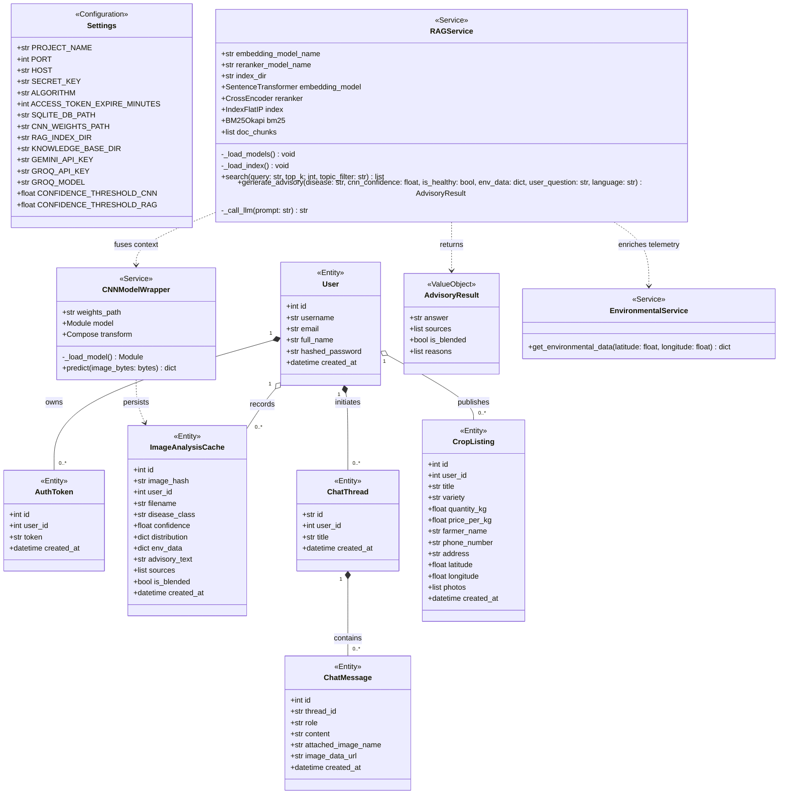

# Low Level Design and Implementation Document
## UE23CS441A – Capstone Project Phase – 3

**Project Title**: PlantIQ: Precision Coffee Agronomy, Computer Vision Foliar Pathology & Decentralized P2P Marketplace System  
**Academic Year**: August – December 2026  
**Department**: Department of Computer Science and Engineering, Faculty of Engineering, PES University, Electronic City Campus, Bengaluru – 560 100, Karnataka, India  

---

[MODULE: COMMON | SECTION: 1.1 Overview | TYPE: Text]
Source: docs/architecture/00_SYSTEM_ARCHITECTURE_OVERVIEW.md, README.md, backend/app/main.py

### 1.1 Overview
This Low-Level Design (LLD) document specifies the concrete software architecture, class models, procedural algorithms, data contracts, and deployment topologies for **PlantIQ** (Production Edition v2.0). PlantIQ is an integrated precision coffee agronomy, deep learning computer vision, and peer-to-peer agricultural commodity marketplace platform engineered specifically for smallholder coffee planters cultivating Arabica (*Coffea arabica*) and Robusta (*Coffea canephora*) across the Western Ghats agro-ecological zones (Chikkamagaluru, Kodagu, and Hassan districts of Karnataka).

The system decomposes into four primary functional modules and a centralized platform infrastructure layer:
1. **Module 1: Leaf Pathology Computer Vision Diagnostic Module**: Real-time foliar pathology identification powered by a fine-tuned ResNet-50 deep residual convolutional network with deterministic SHA-256 deduplication caching.
2. **Module 2: 3-Stage Hybrid RAG Agronomic Knowledge Retrieval Module**: Hallucination-free scientific treatment advisory using dense vector retrieval (BAAI/bge-base-en-v1.5 + FAISS IndexFlatIP), sparse lexical search (BM25Okapi), deep cross-encoder reranking (ms-marco-MiniLM-L-6-v2), and logistic sigmoid score normalization.
3. **Module 3: Multimodal Agronomic Advisory & Linguistic Pre-Routing Module**: Bilingual conversational intelligence with sub-millisecond script detection (Kannada, Kanglish, English), agricultural lexicon mapping, and multi-turn context fusion orchestrated over Google Gemini 2.5 Flash and Groq LPUs (gpt-oss-120b).
4. **Module 4: Precision Microclimate Risk Engine & Spatial Marketplace Module**: Real-time geospatial weather telemetry (Open-Meteo NWP & DEM), epidemiological fungal spore germination risk indices, and decentralized direct-to-buyer crop listing with Haversine distance filtering and native Android OS intent bridges.
5. **Common Platform Infrastructure**: Security guards (PBKDF2-HMAC-SHA256 password hashing, stateless HS256 JWT tokens), SQLite database engine, Pydantic schema validation, and dynamic client-side server IP switching.

---

[MODULE: COMMON | SECTION: 1.2 Purpose | TYPE: Text]
Source: docs/architecture/00_SYSTEM_ARCHITECTURE_OVERVIEW.md, backend/app/main.py

### 1.2 Purpose
The purpose of this Low-Level Design document is to serve as the definitive, unambiguous technical specification for the engineering, testing, academic evaluation, and maintenance of the PlantIQ platform. Specifically, this document:
- Translates the High-Level Design (HLD) and Software Requirements Specification (SRS) into field-level object-oriented schemas, class interfaces, method signatures, parameter types, and algorithmic pseudo-code.
- Formalizes the interaction contracts between the presentation layer (HTML5/CSS3/ES6 and Capacitor 7 Android hybrid runtime) and the asynchronous FastAPI backend service layer.
- Provides rigorous mathematical formulations and procedural workflows for computer vision inference, hybrid information retrieval, linguistic script routing, and microclimate risk indices.
- Establishes full forward and backward traceability between user requirements, architectural components, and physical source code files.

---

[MODULE: COMMON | SECTION: 1.3 Scope | TYPE: Text]
Source: README.md, docs/architecture/00_SYSTEM_ARCHITECTURE_OVERVIEW.md, mobile/capacitor.config.json

### 1.3 Scope
The scope of this document encompasses all software artifacts, machine learning models, database structures, and runtime configurations residing in the repository:
- **Backend Application Services**: Asynchronous REST API endpoints, SQLAlchemy declarative ORM models, Pydantic data validation schemas, PyTorch neural network wrappers, FAISS index managers, and external API connectors.
- **Frontend Presentation Layer**: Semantic multi-page web templates (`index.html`, `chat.html`, `marketplace.html`, `history.html`, `profile.html`, `auth.html`), responsive CSS design systems, dynamic bilingual internationalization dictionaries (`i18n.js`), and audio capture pipelines.
- **Mobile Client Runtime**: Capacitor 7 Android wrapper configurations, AndroidManifest permissions, native intent dispatchers for telephony, WhatsApp, and Google Maps, and dynamic backend IP discovery.
- **Data Persistence**: SQLite relational database schemas (`users`, `auth_tokens`, `image_analysis_cache`, `chat_threads`, `chat_messages`, `crop_listings`), serialized vector embeddings (`faiss_index.bin`), lexical inverted indexes (`bm25_index.pkl`), and document chunk registries (`chunks.pkl`).
- **Excluded from Scope**: Cloud-provider hardware provisioning (e.g., AWS EC2/Render bare metal), proprietary weights training of foundation LLMs (Gemini/Groq), and physical laboratory chemical synthesis of recommended fungicides.

---

[MODULE: COMMON | SECTION: 2 Design Constraints, Assumptions and Dependencies | TYPE: Text]
Source: backend/app/core/config.py, backend/requirements.txt, docs/architecture/06_MOBILE_EDGE_AND_SYSTEM_SECURITY.md

### 2. Design Constraints, Assumptions, and Dependencies

#### 2.1 Design Constraints
1. **Computational Resource Footprint**: The backend server must execute real-time convolutional inference and dense vector embedding on CPU environments without requiring dedicated GPU acceleration. CPU thread concurrency is clamped to a maximum of 8 threads (`torch.set_num_threads`) to prevent core starvation.
2. **Relational Database Concurrency**: SQLite operates in single-writer mode. To prevent thread deadlocks during concurrent image upload and listing creation, connection pooling is disabled with `check_same_thread=False` and transactions are committed atomically.
3. **Network Latency & Remote Plantation Connectivity**: Remote coffee estates in the Western Ghats experience high packet loss and intermittent 2G/3G connectivity. The mobile client APK must maintain a binary footprint under 5 MB, cache diagnostic results deterministically using SHA-256 digests, and support dynamic IP re-binding without recompilation.
4. **LLM Inference Rate Limits & Quotas**: External commercial LLM APIs enforce strict request-per-minute (RPM) quotas. The system must implement graceful secondary failover from Google Gemini 2.5 Flash to Groq LPUs (`openai/gpt-oss-120b`).

#### 2.2 Assumptions
1. **Foliar Image Quality**: Captured leaf photographs possess adequate focus, resolution (minimum $224 \times 224$ pixels), and lighting conditions showing diagnostic foliar symptoms (chlorotic spots, pustules, necrotic lesions).
2. **Geographical Coordinates**: The client device provides valid latitude and longitude coordinates through GPS or manual estate entry falling within the tropical coffee belt ($8^\circ\text{N} - 15^\circ\text{N}, 74^\circ\text{E} - 78^\circ\text{E}$).
3. **Linguistic Fluency**: Farmers interact with the system in English, standard Kannada script (`ಕನ್ನಡ`), or romanized colloquial Kannada ("Kanglish").
4. **Third-Party Service Availability**: Open-Meteo NWP weather APIs, Google Generative AI endpoints, and Groq Cloud endpoints maintain 99.5% operational uptime.

#### 2.3 Dependencies
- **Core Runtime & Web Framework**: Python 3.11+, FastAPI 0.110+, Uvicorn 0.28+, Pydantic v2, Requests.
- **Machine Learning & NLP**: PyTorch 2.2+ (`torch`, `torchvision`), HuggingFace `sentence-transformers` 2.5+, `faiss-cpu` 1.8+, `rank-bm25` 0.2.2, Pillow 10.2+, NumPy.
- **Database & Persistence**: SQLAlchemy 2.0+, SQLite 3.
- **Generative AI & Audio**: `google-generativeai` 0.4+, `groq` 0.5+, PyMuPDF (`fitz`).
- **Mobile & Client Runtime**: Capacitor 7, Node.js 20+, Android SDK API Level 34.

---

[MODULE: COMMON | SECTION: 3.1 Master Class Diagram | TYPE: Mermaid]
Source: backend/app/core/, backend/app/models/, backend/app/services/, backend/app/schemas/

---

[MODULE: COMMON | SECTION: 3.1 Master Class Diagram Decomposition | TYPE: Text]
Source: backend/app/services/, backend/app/models/, backend/app/api/

#### 3.1.1 Architectural Decomposition of Master Class Diagram
The Master Class Diagram above illustrates the unified object topology of PlantIQ. It is decomposed across the functional modules as follows:
- **Section 3.2 (Module 1)** decomposes `CNNModelWrapper` and `ImageAnalysisCache`, including image tensor transformations, Softmax confidence thresholding, SHA-256 deduplication hashing, and cache serialization.
- **Section 3.3 (Module 2)** decomposes `RAGService`, `AdvisoryResult`, and index building mechanisms, detailing the Bi-Encoder dense vector index, BM25Okapi inverted index, and Cross-Encoder joint re-ranking with logistic sigmoid normalization.
- **Section 3.4 (Module 3)** decomposes `ChatThread`, `ChatMessage`, `router_service`, and `voice_service`, defining linguistic routing, multi-turn dialogue memory, base64 image rehydration, and dual-LLM fallback orchestration.
- **Section 3.5 (Module 4)** decomposes `EnvironmentalService` and `CropListing`, detailing numerical weather ingestion, epidemiological fungal spore risk equations, Haversine spatial queries, and native Android intent handshakes.
- **Section 3.6** provides the physical Packaging and Deployment specification mapping these components across client runtimes, gateway proxies, and persistence engines.
