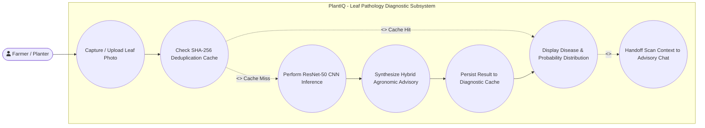
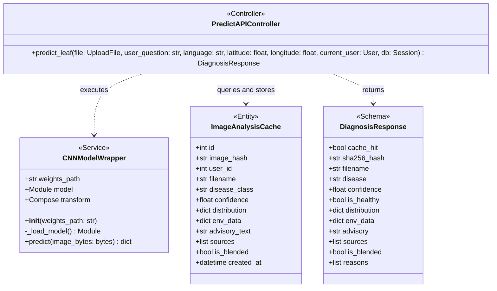
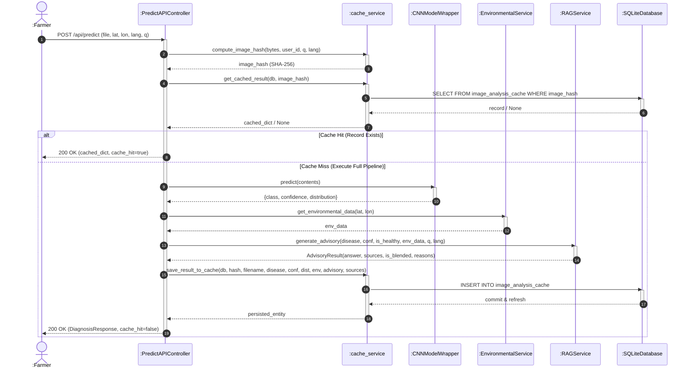

# Module 1: Leaf Pathology Computer Vision Diagnostic Module
## Section 3.2 of Low Level Design Document

[MODULE: Leaf Pathology Computer Vision | SECTION: 3.2.1 Description | TYPE: Text]
Source: backend/app/services/cnn_service.py, backend/app/services/cache_service.py, docs/architecture/01_CNN_DIAGNOSTICS_MODULE.md

### 3.2.1 Description
The Leaf Pathology Computer Vision Diagnostic Module provides automated, real-time foliar disease detection for Arabica and Robusta coffee plantations. The module identifies five primary foliar states:
1. **Coffee Leaf Rust** (*Hemileia vastatrix*): Characterized by orange-yellow powdery pustules on the abaxial leaf surface.
2. **Cercospora Leaf Spot / Brown Eye Spot** (*Cercospora coffeicola*): Characterized by circular brown lesions with grayish-white centers.
3. **Coffee Leaf Miner** (*Leucoptera coffeella*): Characterized by serpentine necrotic blotches and tissue mining.
4. **Phoma Leaf Blight / Dieback** (*Phoma costaricensis*): Characterized by dark brown-to-black necrotic lesions at leaf margins and apical tips.
5. **Healthy Foliage** (Control Class): Intact foliage with normal chlorophyll distribution.

The core computer vision engine utilizes a fine-tuned **ResNet-50** deep residual convolutional neural network ([best_resnet50_coffee.pth](file:///d:/end-capstone-project/cleaned/backend/app/services/best_resnet50_coffee.pth)). Input leaf images are preprocessed through bilinear interpolation to $224 \times 224$ pixels, transformed into PyTorch floating-point tensors, and normalized against ImageNet color distributions ($\mu=[0.485, 0.456, 0.406], \sigma=[0.229, 0.224, 0.225]$).

To eliminate redundant GPU/CPU matrix multiplications during repeated field scans, the module incorporates a deterministic **SHA-256 Deduplication Cache Engine** ([cache_service.py](file:///d:/end-capstone-project/cleaned/backend/app/services/cache_service.py)). When a photograph is uploaded, a composite 64-character hexadecimal digest is computed across the raw binary payload, user identifier, query text, and target language. Cache hits return full diagnostic distributions in $<1\text{ ms}$, bypassing the deep neural pipeline.

---

[MODULE: Leaf Pathology Computer Vision | SECTION: 3.2.2 Use Case Diagram | TYPE: Mermaid]
Source: backend/app/api/predict.py, frontend/static/js/scanner.js, frontend/templates/index.html



---

[MODULE: Leaf Pathology Computer Vision | SECTION: 3.2.2 Use Case Table | TYPE: Table]
Source: backend/app/api/predict.py, frontend/static/js/scanner.js

| Use Case Item | Description |
| :--- | :--- |
| **Capture / Upload Leaf Photo** | Farmer takes a photo using the mobile camera or selects a JPEG/PNG file from the device gallery via the scanner dropzone. |
| **Check SHA-256 Deduplication Cache** | System generates a SHA-256 composite digest of the image bytes, user ID, language, and question, querying `image_analysis_cache`. |
| **Perform ResNet-50 CNN Inference** | On cache miss, the image bytes are normalized and forwarded through the ResNet-50 backbone to output class probabilities via Softmax. |
| **Synthesize Hybrid Agronomic Advisory** | The top predicted disease, confidence score, and GPS microclimate data are submitted to the Hybrid RAG engine for treatment recommendations. |
| **Persist Result to Diagnostic Cache** | The diagnosis, confidence, full distribution dictionary, microclimate telemetry, and RAG advisory are saved to SQLite. |
| **Display Disease & Probability Distribution** | UI renders the predicted disease badge, confidence percentage, gauge meter, and interactive progress bars for all 5 classes. |
| **Handoff Scan Context to Advisory Chat** | Farmer taps "Ask AI about this Scan" to transfer the diagnostic metadata directly into the conversational chatbot thread. |

---

[MODULE: Leaf Pathology Computer Vision | SECTION: 3.2.3 Class Diagram | TYPE: Mermaid]
Source: backend/app/services/cnn_service.py, backend/app/services/cache_service.py, backend/app/models/cache.py, backend/app/schemas/predict.py



---

[MODULE: Leaf Pathology Computer Vision | SECTION: 3.2.3.1 Class Description - CNNModelWrapper | TYPE: Text]
Source: backend/app/services/cnn_service.py

#### 3.2.3.1 Class Description: `CNNModelWrapper`
`CNNModelWrapper` encapsulates the PyTorch deep residual neural network architecture, model weight loading, input tensor transformations, and execution inference. It maintains a singleton instance of the fine-tuned ResNet-50 model, configures execution device hardware (CUDA GPU if available, else multi-threaded CPU), replaces the final fully connected classification head with a Dropout (0.4) and Linear layer sized for 5 coffee disease classes, and provides thread-safe inference producing calibrated class probability distributions.

#### 3.2.3.2 Class Name: `CNNModelWrapper`

#### 3.2.3.3 Data Members: `CNNModelWrapper`
Source: backend/app/services/cnn_service.py

| Data Type | Data Name | Access Modifiers | Initial Value | Description |
| :--- | :--- | :--- | :--- | :--- |
| `str` | `weights_path` | Public (`+`) | `settings.CNN_WEIGHTS_PATH` | File system path to the serialized PyTorch model state dictionary (`best_resnet50_coffee.pth`). |
| `torch.nn.Module` | `model` | Public (`+`) | Return of `_load_model()` | Instantiated ResNet-50 neural network instance configured in evaluation mode (`eval()`). |
| `torchvision.transforms.Compose` | `transform` | Public (`+`) | Composed transform pipeline | Transformation sequence: Resize to $(224, 224)$, convert to tensor, and ImageNet channel normalization. |

---

[MODULE: Leaf Pathology Computer Vision | SECTION: 3.2.3.4 Method: CNNModelWrapper.__init__ | TYPE: Text]
Source: backend/app/services/cnn_service.py:14-22

#### 3.2.3.4 Method: `__init__(self, weights_path: str = settings.CNN_WEIGHTS_PATH)`
- **Purpose**: Initializes the CNN wrapper, sets weights path, builds input tensor pipeline, and triggers model loading.
- **Input**: `weights_path` (str, optional).
- **Output**: None (`void`).
- **Parameters**:
  - `weights_path` (`str`): Target path to PyTorch state dictionary. Defaults to `settings.CNN_WEIGHTS_PATH`.
- **Exceptions**: `FileNotFoundError`, `RuntimeError` if weights cannot be mapped to device memory.
- **Pseudo-code**:
```python
SET self.weights_path = weights_path
SET self.model = CALL self._load_model()
SET self.transform = transforms.Compose([
    transforms.Resize((224, 224)),
    transforms.ToTensor(),
    transforms.Normalize(mean=[0.485, 0.456, 0.406], std=[0.229, 0.224, 0.225])
])
```

---

[MODULE: Leaf Pathology Computer Vision | SECTION: 3.2.3.5 Method: CNNModelWrapper._load_model | TYPE: Text]
Source: backend/app/services/cnn_service.py:24-42

#### 3.2.3.5 Method: `_load_model(self) -> torch.nn.Module`
- **Purpose**: Constructs the ResNet-50 network architecture, adapts the final fully connected layer for 5 target classes, loads checkpoint weights, transfers the model to the target device, and freezes layers for evaluation.
- **Input**: None.
- **Output**: Instantiated and initialized `torch.nn.Module`.
- **Parameters**: None.
- **Exceptions**: Catches generic `Exception` and logs error message if weights fail to load, maintaining architecture in uninitialized state.
- **Pseudo-code**:
```python
SET model = models.resnet50(weights=None)
SET num_features = model.fc.in_features
SET model.fc = nn.Sequential(
    nn.Dropout(0.4),
    nn.Linear(num_features, len(CLASSES))
)
IF FILE_EXISTS(self.weights_path) THEN
    TRY
        SET state_dict = torch.load(self.weights_path, map_location=device)
        CALL model.load_state_dict(state_dict)
        LOG "[Cleaned CNN] Loaded weights successfully"
    CATCH Exception AS e
        LOG "[Cleaned CNN] Error loading weights: " + e
    END TRY
ELSE
    LOG "[Cleaned CNN] Warning: weights path not found: " + self.weights_path
END IF
SET model = model.to(device)
CALL model.eval()
RETURN model
```

---

[MODULE: Leaf Pathology Computer Vision | SECTION: 3.2.3.6 Method: CNNModelWrapper.predict | TYPE: Text]
Source: backend/app/services/cnn_service.py:44-61

#### 3.2.3.6 Method: `predict(self, image_bytes: bytes) -> Dict[str, Any]`
- **Purpose**: Ingests raw image binary bytes, decodes them to RGB, applies the normalization transform, executes a forward pass under `torch.no_grad()`, and returns the top predicted class, confidence percentage, and complete class probability distribution.
- **Input**: `image_bytes` (`bytes`).
- **Output**: `Dict[str, Any]` containing `'class'`, `'confidence'`, and `'distribution'`.
- **Parameters**:
  - `image_bytes` (`bytes`): Raw byte buffer of the uploaded image file.
- **Exceptions**: Catches generic `Exception` on corrupted image buffers and returns error dictionary with class `'Unknown'`.
- **Pseudo-code**:
```python
TRY
    SET img = Image.open(BytesIO(image_bytes)).convert('RGB')
    SET tensor = self.transform(img).unsqueeze(0).to(device)
    WITH torch.no_grad():
        SET outputs = self.model(tensor)
        SET probabilities = F.softmax(outputs, dim=1)[0]
        SET confidence, predicted_idx = torch.max(probabilities, 0)
    END WITH
    SET predicted_class = CLASSES[predicted_idx.item()]
    SET conf_percent = FLOAT(confidence.item() * 100.0)
    SET distribution = EMPTY_DICTIONARY
    FOR i FROM 0 TO len(CLASSES) - 1 DO
        SET distribution[CLASSES[i]] = FLOAT(probabilities[i].item() * 100.0)
    END FOR
    RETURN {
        'class': predicted_class,
        'confidence': conf_percent,
        'distribution': distribution
    }
CATCH Exception AS e
    RETURN {'error': STRING(e), 'class': 'Unknown', 'confidence': 0.0, 'distribution': {}}
END TRY
```

---

[MODULE: Leaf Pathology Computer Vision | SECTION: 3.2.3.7 Class Description - ImageAnalysisCache | TYPE: Text]
Source: backend/app/models/cache.py:5-18

#### 3.2.3.7 Class Description: `ImageAnalysisCache`
`ImageAnalysisCache` is a declarative SQLAlchemy ORM model mapped to the `image_analysis_cache` relational database table. It stores deterministic diagnostic records indexed by unique SHA-256 image hashes. Each record encapsulates the classified disease class, confidence score, 5-class distribution dictionary, associated microclimate environmental parameters, generated agronomic advisory text, bibliography sources, blended flag, and creation timestamp.

#### 3.2.3.8 Class Name: `ImageAnalysisCache`

#### 3.2.3.9 Data Members: `ImageAnalysisCache`
Source: backend/app/models/cache.py:7-18

| Data Type | Data Name | Access Modifiers | Initial Value | Description |
| :--- | :--- | :--- | :--- | :--- |
| `Integer` | `id` | Public (`+`) | Auto-increment Primary Key | Unique internal relational identifier for the cache record. |
| `String` | `image_hash` | Public (`+`) | None (Unique, Indexed, Not Null) | 64-character SHA-256 composite hexadecimal digest. |
| `Integer` | `user_id` | Public (`+`) | None (Nullable, Indexed) | User ID of the farmer requesting the diagnosis (foreign key to `users.id`). |
| `String` | `filename` | Public (`+`) | None (Nullable) | Original filename of the uploaded leaf photograph. |
| `String` | `disease_class` | Public (`+`) | None (Not Null) | Predicted disease label (`'Rust'`, `'Cerscospora'`, `'Miner'`, `'Phoma'`, `'Healthy'`). |
| `Float` | `confidence` | Public (`+`) | None (Not Null) | Calibrated prediction confidence score in percent ($0.0 - 100.0$). |
| `JSON` | `distribution` | Public (`+`) | None (Not Null) | JSON dictionary mapping all 5 classes to their respective percentage probabilities. |
| `JSON` | `env_data` | Public (`+`) | None (Nullable) | Snapshot of microclimate weather telemetry recorded during diagnosis. |
| `String` | `advisory_text` | Public (`+`) | None (Not Null) | Grounded treatment advice synthesized by the Hybrid RAG engine. |
| `JSON` | `sources` | Public (`+`) | None (Nullable) | List of CCRI literature documents and agronomic extension sources cited. |
| `Boolean` | `is_blended` | Public (`+`) | `False` | Flag indicating whether confidence fell below thresholds, triggering blended advisory. |
| `DateTime` | `created_at` | Public (`+`) | `datetime.utcnow` | Timestamp marking when the record was persisted. |

---

[MODULE: Leaf Pathology Computer Vision | SECTION: 3.2.3.10 Helper Functions - cache_service | TYPE: Text]
Source: backend/app/services/cache_service.py:6-66

#### 3.2.3.10 Helper Functions: `cache_service.py`

##### Function 1: `compute_image_hash(image_bytes: bytes, user_id: Optional[int] = None, user_question: Optional[str] = None, language: str = 'en') -> str`
- **Purpose**: Generates a deterministic SHA-256 hexadecimal hash across the image payload, user context, query string, and target language.
- **Input**: Raw image binary buffer, optional user ID, optional query string, language code.
- **Output**: 64-character hexadecimal digest string.
- **Parameters**:
  - `image_bytes` (`bytes`): Raw binary byte buffer of the uploaded leaf photograph.
  - `user_id` (`Optional[int]`, default `None`): User ID of the requesting planter for user-scoped cache isolation.
  - `user_question` (`Optional[str]`, default `None`): Specific agronomic question string entered by the user.
  - `language` (`str`, default `'en'`): Target response language code (`'en'` for English, `'kn'` for Kannada).
- **Exceptions**: None (pure deterministic in-memory cryptographic hashing).
- **Pseudo-code**:
```python
SET hasher = hashlib.sha256()
CALL hasher.update(image_bytes)
CALL hasher.update(ENCODE("_user_" + STRING(user_id OR 0)))
IF user_question IS NOT NULL THEN
    CALL hasher.update(ENCODE("_q_" + LOWER(TRIM(user_question))))
END IF
CALL hasher.update(ENCODE("_lang_" + language))
RETURN hasher.hexdigest()
```

##### Function 2: `get_cached_result(db: Session, image_hash: str) -> Optional[Dict[str, Any]]`
- **Purpose**: Queries `ImageAnalysisCache` for an existing record matching the provided composite SHA-256 digest.
- **Input**: Database session `db`, hash string `image_hash`.
- **Output**: Formatted dictionary if found, else `None`.
- **Parameters**:
  - `db` (`Session`): Active SQLAlchemy relational database session.
  - `image_hash` (`str`): 64-character SHA-256 composite hexadecimal digest string.
- **Exceptions**: `SQLAlchemyError` on database connectivity failure or table access error.
- **Pseudo-code**:
```python
SET record = db.query(ImageAnalysisCache).filter(ImageAnalysisCache.image_hash == image_hash).first()
IF record IS NULL THEN
    RETURN None
END IF
RETURN {
    'cache_hit': True,
    'sha256_hash': record.image_hash,
    'filename': record.filename,
    'disease': record.disease_class,
    'confidence': record.confidence,
    'is_healthy': (record.disease_class == 'Healthy'),
    'distribution': record.distribution,
    'env_data': record.env_data,
    'advisory': record.advisory_text,
    'sources': record.sources,
    'is_blended': record.is_blended,
    'reasons': ['Retrieved from user-scoped SHA-256 deduplication cache.']
}
```

##### Function 3: `save_result_to_cache(db: Session, ...) -> ImageAnalysisCache`
- **Purpose**: Persists a new diagnosis result into `ImageAnalysisCache` if not already present.
- **Input**: Database session, image hash, filename, disease class, confidence, distribution, env_data, advisory_text, sources, is_blended, user_id.
- **Output**: Persisted `ImageAnalysisCache` ORM entity.
- **Parameters**:
  - `db` (`Session`): Active SQLAlchemy relational database session.
  - `image_hash` (`str`): 64-character SHA-256 composite hexadecimal digest string.
  - `filename` (`str`): File name of the uploaded leaf photograph.
  - `disease_class` (`str`): Predicted pathology class (`'Rust'`, `'Miner'`, `'Phoma'`, `'Healthy'`, `'Cerscospora'`).
  - `confidence` (`float`): Softmax prediction confidence percentage ($0.0 - 100.0$).
  - `distribution` (`dict`): Dictionary mapping all 5 disease classes to their percentage probabilities.
  - `env_data` (`Optional[dict]`): Real-time microclimate parameters logged during diagnosis.
  - `advisory_text` (`str`): Grounded agronomic advisory synthesized by RAG.
  - `sources` (`Optional[list]`): List of CCRI reference literature sources cited.
  - `is_blended` (`bool`, default `False`): Confidence gating flag indicating blended advice.
  - `user_id` (`Optional[int]`, default `None`): User identifier for ownership mapping.
- **Exceptions**: `IntegrityError` if duplicate hash is inserted concurrently; `SQLAlchemyError` on database transaction failure.
- **Pseudo-code**:
```python
SET existing = db.query(ImageAnalysisCache).filter(ImageAnalysisCache.image_hash == image_hash).first()
IF existing IS NOT NULL THEN
    RETURN existing
END IF
SET record = NEW ImageAnalysisCache(
    image_hash=image_hash, user_id=user_id, filename=filename, disease_class=disease_class,
    confidence=confidence, distribution=distribution, env_data=env_data,
    advisory_text=advisory_text, sources=sources, is_blended=is_blended
)
CALL db.add(record)
CALL db.commit()
CALL db.refresh(record)
RETURN record
```

---

[MODULE: Leaf Pathology Computer Vision | SECTION: 3.2.4 Sequence Diagram | TYPE: Mermaid]
Source: backend/app/api/predict.py, backend/app/services/cnn_service.py, backend/app/services/cache_service.py


