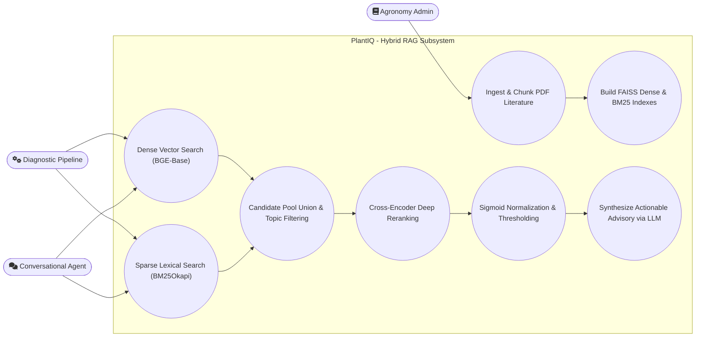
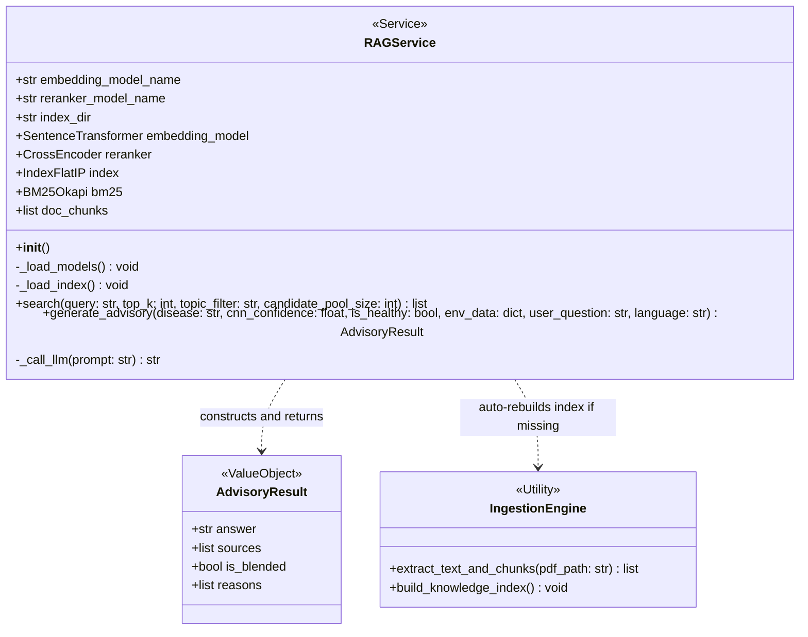
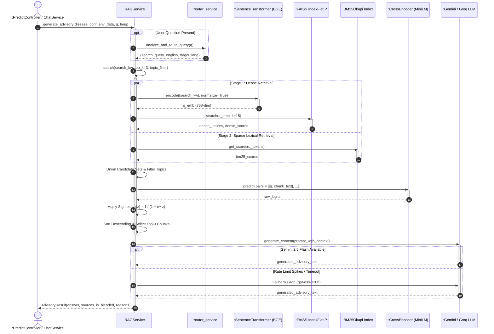

# Module 2: 3-Stage Hybrid RAG Knowledge Retrieval Module
## Section 3.3 of Low Level Design Document

[MODULE: 3-Stage Hybrid RAG | SECTION: 3.3.1 Description | TYPE: Text]
Source: backend/app/services/rag_service.py, backend/app/services/build_index.py, docs/architecture/02_ADVANCED_HYBRID_RAG_MODULE.md

### 3.3.1 Description
The 3-Stage Hybrid RAG Agronomic Knowledge Retrieval Module provides verifiable, hallucination-free chemical dosage recommendations, disease management protocols, and cultural canopy practices authored by the **Central Coffee Research Institute (CCRI)** and international agronomic research literature.

Standard naive RAG systems rely exclusively on dense cosine vector comparisons, which suffer from vocabulary mismatch on specialized chemical formulations (e.g., distinguishing between *"Bordeaux mixture 1%"*, *"Bordeaux mixture 0.5%"*, and *"Copper Oxychloride 50 WP"*). To guarantee sub-millimeter precision on chemical dosages, PlantIQ implements a production 3-stage retrieval and reranking pipeline:
1. **Dense Semantic Bi-Encoder Retrieval**: Generates 768-dimensional normalized dense vector representations via `BAAI/bge-base-en-v1.5` and executes inner-product search over a FAISS `IndexFlatIP` vector index to extract the Top-15 semantic candidate chunks.
2. **Sparse Lexical Inverted Search**: Simultaneously evaluates exact chemical, pathogen, and dosage keyword tokens using a `BM25Okapi` inverted index ($k_1=1.5, b=0.75$) to extract the Top-15 lexical candidate chunks.
3. **Candidate Pool Union & Deep Cross-Encoder Reranking**: Combines the candidate sets into an index union and executes full cross-attention token-to-token reranking using `cross-encoder/ms-marco-MiniLM-L-6-v2`.
4. **Logistic Sigmoid Normalization**: Maps unconstrained cross-encoder logits $z \in (-\infty, +\infty)$ to a stable probability interval $[0.0, 1.0]$ via the standard logistic sigmoid function:
   $$\sigma(z) = \frac{1}{1 + e^{-z}}$$
   A score $\ge 0.50$ confirms high agronomic relevance. If confidence falls below threshold, blended reasoning is triggered.
5. **Knowledge Base Ingestion Engine**: [build_index.py](file:///d:/end-capstone-project/cleaned/backend/app/services/build_index.py) parses 14 CCRI agronomy manuals and scientific publications, detecting structural section boundaries to produce coherent 200–400 token chunks enriched with metadata tags (`source`, `page`, `section`, `topic`).

---

[MODULE: 3-Stage Hybrid RAG | SECTION: 3.3.2 Use Case Diagram | TYPE: Mermaid]
Source: backend/app/services/rag_service.py, backend/app/services/build_index.py



---

[MODULE: 3-Stage Hybrid RAG | SECTION: 3.3.2 Use Case Table | TYPE: Table]
Source: backend/app/services/rag_service.py, backend/app/services/build_index.py

| Use Case Item | Description |
| :--- | :--- |
| **Ingest & Chunk PDF Literature** | Ingestion pipeline extracts text from CCRI agronomy manuals and applies semantic section chunking (200–400 tokens with heading retention). |
| **Build FAISS Dense & BM25 Indexes** | Encodes chunks into 768-dim normalized BGE vectors, writes `faiss_index.bin`, builds token inverted index, and serializes `bm25_index.pkl`. |
| **Dense Vector Search (BGE-Base)** | Queries FAISS `IndexFlatIP` using $L_2$-normalized dense embeddings to retrieve Top-15 semantically similar agronomic text segments. |
| **Sparse Lexical Search (BM25Okapi)** | Evaluates exact term frequencies of chemical and disease keywords against the inverted token index to retrieve Top-15 lexical matches. |
| **Candidate Pool Union & Topic Filtering** | Merges dense and sparse chunk candidates and applies optional topic gating (`leaf_rust`, `cercospora_leaf_spot`, `leaf_miner`, `phoma_blight`). |
| **Cross-Encoder Deep Reranking** | Submits `[Query, Chunk]` pairs to `ms-marco-MiniLM-L-6-v2` for exhaustive multi-head cross-attention relevance scoring. |
| **Sigmoid Normalization & Thresholding** | Applies logistic sigmoid mapping $\sigma(z) = 1/(1+e^{-z})$ to bound scores within $[0.0, 1.0]$ and evaluates confidence against `CONFIDENCE_THRESHOLD_RAG` (0.50). |
| **Synthesize Actionable Advisory via LLM** | Injects retrieved knowledge chunks, disease telemetry, and microclimate parameters into Gemini 2.5 Flash / Groq LLM to produce structured Kannada/English advice. |

---

[MODULE: 3-Stage Hybrid RAG | SECTION: 3.3.3 Class Diagram | TYPE: Mermaid]
Source: backend/app/services/rag_service.py, backend/app/services/build_index.py



---

[MODULE: 3-Stage Hybrid RAG | SECTION: 3.3.3.1 Class Description - RAGService | TYPE: Text]
Source: backend/app/services/rag_service.py:35-333

#### 3.3.3.1 Class Description: `RAGService`
`RAGService` is a singleton service that manages the lifecycle, loading, and execution of the multi-stage hybrid retrieval-augmented generation engine. It loads the `BAAI/bge-base-en-v1.5` dense embedding model, the `cross-encoder/ms-marco-MiniLM-L-6-v2` reranker, the FAISS dense vector index (`faiss_index.bin`), the serialized document chunk store (`chunks.pkl`), and the BM25Okapi lexical index (`bm25_index.pkl`). It coordinates multi-threaded retrieval, cross-attention scoring, sigmoid normalization, topic filtering, prompt synthesis, and dual-LLM generation.

#### 3.3.3.2 Class Name: `RAGService`

#### 3.3.3.3 Data Members: `RAGService`
Source: backend/app/services/rag_service.py:37-45

| Data Type | Data Name | Access Modifiers | Initial Value | Description |
| :--- | :--- | :--- | :--- | :--- |
| `str` | `embedding_model_name` | Public (`+`) | `"BAAI/bge-base-en-v1.5"` | HuggingFace identifier for the dense bi-encoder embedding model. |
| `str` | `reranker_model_name` | Public (`+`) | `"cross-encoder/ms-marco-MiniLM-L-6-v2"` | HuggingFace identifier for the cross-encoder reranking transformer. |
| `str` | `index_dir` | Public (`+`) | `settings.RAG_INDEX_DIR` | Directory containing serialized FAISS binary and pickle index files. |
| `SentenceTransformer` | `embedding_model` | Public (`+`) | `None` (Initialized via `_load_models`) | Instantiated SentenceTransformer instance producing 768-dim normalized embeddings. |
| `CrossEncoder` | `reranker` | Public (`+`) | `None` (Initialized via `_load_models`) | Instantiated CrossEncoder transformer for joint query-document cross-attention. |
| `faiss.IndexFlatIP` | `index` | Public (`+`) | `None` (Loaded via `_load_index`) | FAISS inner-product flat vector index storing normalized chunk embeddings. |
| `rank_bm25.BM25Okapi`| `bm25` | Public (`+`) | `None` (Loaded via `_load_index`) | BM25Okapi lexical scoring model over tokenized agronomy chunks. |
| `List[Dict[str, Any]]`| `doc_chunks` | Public (`+`) | `[]` | List of chunk dictionaries containing text, source, page, section, and topic metadata. |

---

[MODULE: 3-Stage Hybrid RAG | SECTION: 3.3.3.4 Method: RAGService.__init__ | TYPE: Text]
Source: backend/app/services/rag_service.py:36-49

#### 3.3.3.4 Method: `__init__(self)`
- **Purpose**: Initializes class configurations, establishes directory pointers, and initiates model and index loading routines.
- **Input**: None.
- **Output**: None (`void`).
- **Parameters**: None.
- **Exceptions**: None.
- **Pseudo-code**:
```python
SET self.embedding_model_name = "BAAI/bge-base-en-v1.5"
SET self.reranker_model_name = "cross-encoder/ms-marco-MiniLM-L-6-v2"
SET self.index_dir = settings.RAG_INDEX_DIR
SET self.embedding_model = None
SET self.reranker = None
SET self.index = None
SET self.bm25 = None
SET self.doc_chunks = []
CALL self._load_models()
CALL self._load_index()
```

---

[MODULE: 3-Stage Hybrid RAG | SECTION: 3.3.3.5 Method: RAGService._load_models | TYPE: Text]
Source: backend/app/services/rag_service.py:50-59

#### 3.3.3.5 Method: `_load_models(self)`
- **Purpose**: Instantiates dense embedding and cross-encoder models into memory.
- **Input**: None.
- **Output**: None (`void`).
- **Parameters**: None.
- **Exceptions**: Catches generic `Exception`, logs warning, and permits graceful degradation if model downloads fail.
- **Pseudo-code**:
```python
TRY
    LOG "[Cleaned RAG] Loading Dense Embedding model: " + self.embedding_model_name
    SET self.embedding_model = SentenceTransformer(self.embedding_model_name)
    LOG "[Cleaned RAG] Loading Cross-Encoder Reranker: " + self.reranker_model_name
    SET self.reranker = CrossEncoder(self.reranker_model_name)
    LOG "[Cleaned RAG] AI Models initialized successfully."
CATCH Exception AS e
    LOG "[Cleaned RAG] Warning during model initialization: " + e
END TRY
```

---

[MODULE: 3-Stage Hybrid RAG | SECTION: 3.3.3.6 Method: RAGService._load_index | TYPE: Text]
Source: backend/app/services/rag_service.py:60-100

#### 3.3.3.6 Method: `_load_index(self)`
- **Purpose**: Loads FAISS index binary, pickled document chunks, and BM25 index. If absent, triggers automated rebuilding from source PDFs via `build_knowledge_index()`.
- **Input**: None.
- **Output**: None (`void`).
- **Parameters**: None.
- **Exceptions**: Catches file I/O and unpickling errors, falling back to automated rebuild.
- **Pseudo-code**:
```python
SET index_file = JOIN_PATH(self.index_dir, "faiss_index.bin")
SET chunks_file = JOIN_PATH(self.index_dir, "chunks.pkl")
SET bm25_file = JOIN_PATH(self.index_dir, "bm25_index.pkl")

IF FILE_EXISTS(index_file) AND FILE_EXISTS(chunks_file) THEN
    TRY
        SET self.index = faiss.read_index(index_file)
        WITH OPEN(chunks_file, "rb") AS f:
            SET self.doc_chunks = pickle.load(f)
    CATCH Exception AS e:
        LOG "Error loading FAISS index: " + e
    END TRY
END IF

IF FILE_EXISTS(bm25_file) THEN
    TRY
        WITH OPEN(bm25_file, "rb") AS f:
            SET data = pickle.load(f)
            SET self.bm25 = data["bm25"]
    CATCH Exception AS e:
        LOG "Error loading BM25 index: " + e
    END TRY
END IF

IF self.index IS NULL OR len(self.doc_chunks) == 0 OR self.bm25 IS NULL THEN
    LOG "Index files missing. Auto-rebuilding from knowledge_base PDFs..."
    TRY
        CALL build_knowledge_index()
        RELOAD index_file, chunks_file, and bm25_file
    CATCH Exception AS e:
        LOG "Auto-rebuild failed: " + e
    END TRY
END IF
```

---

[MODULE: 3-Stage Hybrid RAG | SECTION: 3.3.3.7 Method: RAGService.search | TYPE: Text]
Source: backend/app/services/rag_service.py:101-216

#### 3.3.3.7 Method: `search(self, query: str, top_k: int = 3, topic_filter: Optional[str] = None, candidate_pool_size: int = 15) -> List[Dict[str, Any]]`
- **Purpose**: Executes 3-Stage hybrid retrieval: dense BGE vector search + sparse BM25 search + cross-encoder reranking with logistic sigmoid score normalization.
- **Input**: Cleaned search query string, target Top-K count, optional topic string, candidate pool size.
- **Output**: Ranked list of Top-K document dictionaries with normalized scores and metadata.
- **Parameters**:
  - `query` (`str`): Cleaned agronomy keyword query.
  - `top_k` (`int`): Number of final reranked chunks to return (default 3).
  - `topic_filter` (`Optional[str]`): Agronomic topic domain filter.
  - `candidate_pool_size` (`int`): Number of candidate IDs to harvest per retrieval stream (default 15).
- **Exceptions**: Catches internal scoring exceptions and falls back to Reciprocal Rank Fusion / weighted scoring ($0.65 \times \text{dense} + 0.35 \times \text{sparse}$).
- **Pseudo-code**:
```python
IF query IS EMPTY OR len(self.doc_chunks) == 0 THEN
    RETURN []
END IF
SET clean_q = query.strip()
SET k_candidates = min(candidate_pool_size, len(self.doc_chunks))
SET candidate_indices = EMPTY_SET()
SET dense_scores_map = EMPTY_DICT()
SET sparse_scores_map = EMPTY_DICT()

# Stage 1: Dense Retrieval
IF self.index AND self.embedding_model THEN
    SET q_emb = self.embedding_model.encode([clean_q], normalize_embeddings=True)
    SET d_scores, d_indices = self.index.search(q_emb, k_candidates)
    FOR EACH score, idx IN d_scores[0], d_indices[0] DO
        IF idx != -1 THEN
            candidate_indices.add(idx)
            dense_scores_map[idx] = FLOAT(score)
        END IF
    END FOR
END IF

# Stage 2: Sparse BM25 Retrieval
IF self.bm25 THEN
    SET q_tokens = EXTRACT_WORDS(clean_q.lower())
    IF len(q_tokens) > 0 THEN
        SET bm25_scores = self.bm25.get_scores(q_tokens)
        SET top_sparse_idx = ARGSORT_DESCENDING(bm25_scores)[:k_candidates]
        SET max_sparse = MAX(bm25_scores) OR 1.0
        FOR EACH idx IN top_sparse_idx DO
            IF bm25_scores[idx] > 0 THEN
                candidate_indices.add(idx)
                sparse_scores_map[idx] = bm25_scores[idx] / max_sparse
            END IF
        END FOR
    END IF
END IF

# Filter by topic
SET valid_candidates = []
FOR EACH idx IN candidate_indices DO
    SET chunk = self.doc_chunks[idx]
    IF topic_filter IS NULL OR chunk.get("topic") == topic_filter THEN
        valid_candidates.append((idx, chunk))
    END IF
END FOR

# Stage 3: Cross-Encoder Reranking
SET scored_results = []
IF self.reranker AND len(valid_candidates) > 0 THEN
    SET pairs = [[clean_q, chunk["text"]] FOR _, chunk IN valid_candidates]
    SET raw_logits = self.reranker.predict(pairs)
    FOR EACH (idx, chunk), logit IN valid_candidates, raw_logits DO
        # Logistic Sigmoid Normalization
        SET norm_score = 1.0 / (1.0 + EXP(-FLOAT(logit)))
        norm_score = MAX(0.0, MIN(1.0, norm_score))
        scored_results.append({
            "text": chunk["text"],
            "source": chunk.get("source", "CCRI Coffee Agronomy Manual"),
            "score": ROUND(norm_score, 4),
            "metadata": {"page": chunk.get("page", 1), "section": chunk.get("section", ""), "topic": chunk.get("topic", "")}
        })
    END FOR
END IF

SORT scored_results BY score DESCENDING
RETURN scored_results[:top_k]
```

---

[MODULE: 3-Stage Hybrid RAG | SECTION: 3.3.3.8 Method: RAGService.generate_advisory | TYPE: Text]
Source: backend/app/services/rag_service.py:217-298

#### 3.3.3.8 Method: `generate_advisory(self, disease: str, cnn_confidence: float, is_healthy: bool, env_data: Optional[Dict[str, Any]] = None, user_question: Optional[str] = None, language: str = "en") -> AdvisoryResult`
- **Purpose**: Orchestrates end-to-end advisory generation by mapping input metadata to agronomic search queries, executing hybrid search, evaluating confidence thresholds, assembling system prompts, and querying foundation LLMs.
- **Input**: Classified disease name, CNN confidence score, healthy flag, microclimate dictionary, user question, language code.
- **Output**: `AdvisoryResult` value object.
- **Parameters**: Listed above.
- **Exceptions**: Handles upstream LLM connection timeouts by invoking secondary fallback mechanisms.
- **Pseudo-code**:
```python
SET search_kw = "coffee " + disease + " control management treatment dosage fungicide"
SET target_lang = language
IF user_question IS NOT NULL THEN
    SET route_meta = CALL analyze_and_route_query(user_question)
    IF route_meta.search_query_english THEN
        SET search_kw = "coffee " + disease + " " + route_meta.search_query_english
    END IF
    IF route_meta.target_response_language THEN
        SET target_lang = route_meta.target_response_language
    END IF
END IF

SET topic_filter = MAP_DISEASE_TO_TOPIC(disease)
SET retrieved_docs = CALL self.search(search_kw, top_k=3, topic_filter=topic_filter)
SET max_rag_score = MAX([d["score"] FOR d IN retrieved_docs]) OR 0.0

SET is_blended = (cnn_confidence < settings.CONFIDENCE_THRESHOLD_CNN) OR (max_rag_score < settings.CONFIDENCE_THRESHOLD_RAG)
SET reasons = []
IF cnn_confidence < settings.CONFIDENCE_THRESHOLD_CNN THEN
    reasons.append("CNN confidence below threshold.")
END IF
IF max_rag_score < settings.CONFIDENCE_THRESHOLD_RAG THEN
    reasons.append("Hybrid Reranker relevance below threshold.")
END IF

SET prompt = ASSEMBLE_PROMPT(disease, cnn_confidence, env_data, user_question, retrieved_docs, target_lang)
SET answer = CALL self._call_llm(prompt)
SET sources = [d["source"] FOR d IN retrieved_docs]

RETURN NEW AdvisoryResult(answer=answer, sources=sources, is_blended=is_blended, reasons=reasons)
```

---

[MODULE: 3-Stage Hybrid RAG | SECTION: 3.3.4 Sequence Diagram | TYPE: Mermaid]
Source: backend/app/services/rag_service.py, backend/app/services/router_service.py


