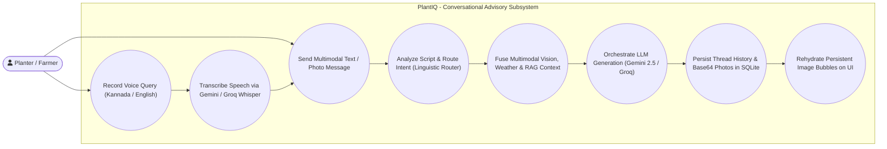
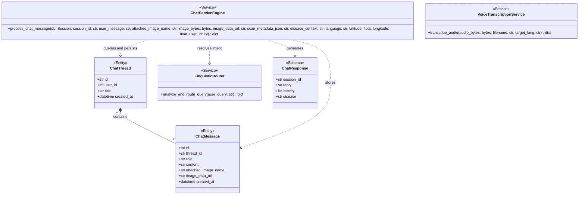
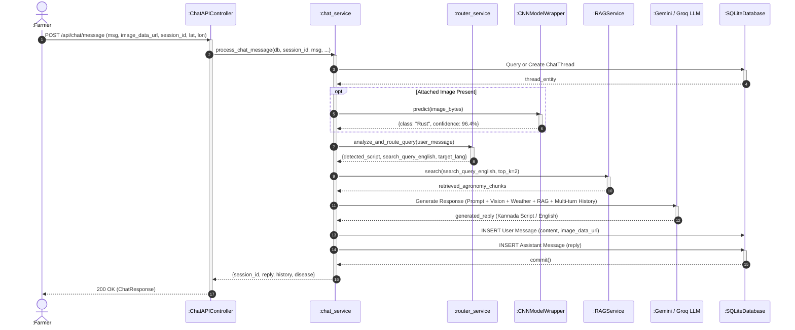

# Module 3: Multimodal Agronomic Advisory & Linguistic Pre-Routing Module
## Section 3.4 of Low Level Design Document

[MODULE: Multimodal Chat & Routing | SECTION: 3.4.1 Description | TYPE: Text]
Source: backend/app/services/router_service.py, backend/app/services/chat_service.py, backend/app/services/voice_service.py, docs/architecture/03_MULTIMODAL_CHATBOT_AND_ROUTING.md

### 3.4.1 Description
The Multimodal Agronomic Advisory & Linguistic Pre-Routing Module delivers a multi-turn, bilingual conversational interface engineered for smallholder planters across the Karnataka coffee zone. Smallholder farmers communicate across three distinct linguistic modalities:
1. Standard Kannada Script (`ಕನ್ನಡ ಲಿಪಿ`)
2. Romanized Colloquial Kannada / Kanglish (e.g., *"ele mele haladi chukke idhe, yava aushadhi hodibeku?"*)
3. Indian English agricultural terminology.

To resolve this complexity without introducing conversational latency, the module implements a sub-millisecond **Linguistic Pre-Router** ([router_service.py](file:///d:/end-capstone-project/cleaned/backend/app/services/router_service.py)). The router inspects Unicode character ranges (`\u0C80-\u0CFF`) and executes zero-shot phonetic intent classification. It extracts normalized English search terms for the Hybrid RAG engine while commanding the generative LLM to format its response strictly in native Kannada script.

The dialogue engine ([chat_service.py](file:///d:/end-capstone-project/cleaned/backend/app/services/chat_service.py)) supports multimodal leaf photograph uploads directly within chat bubbles, ingesting raw image bytes into the ResNet-50 vision classifier and attaching base64 data URIs into SQLite relational storage ([models/chat.py](file:///d:/end-capstone-project/cleaned/backend/app/models/chat.py)). Conversations are structured into parent threads (`ChatThread`) and ordered messages (`ChatMessage`). Furthermore, speech inputs captured via browser MediaRecorder are transcribed in [voice_service.py](file:///d:/end-capstone-project/cleaned/backend/app/services/voice_service.py) via Google Gemini 1.5/2.5 Audio with fallback to Groq Whisper Large-v3.

---

[MODULE: Multimodal Chat & Routing | SECTION: 3.4.2 Use Case Diagram | TYPE: Mermaid]
Source: backend/app/api/chat.py, backend/app/api/voice.py, frontend/static/js/chat.js, frontend/static/js/voice.js



---

[MODULE: Multimodal Chat & Routing | SECTION: 3.4.2 Use Case Table | TYPE: Table]
Source: backend/app/api/chat.py, backend/app/api/voice.py

| Use Case Item | Description |
| :--- | :--- |
| **Send Multimodal Text / Photo Message** | Farmer submits a text question in Kannada, Kanglish, or English, with optional camera/gallery leaf photo attachments. |
| **Record Voice Query** | Farmer taps microphone to capture spoken query; frontend prompts target language modal and streams audio blob to backend. |
| **Analyze Script & Route Intent** | Linguistic Router identifies script type, extracts English search keywords, and sets target response language. |
| **Transcribe Speech** | Voice service processes audio buffers via Gemini Audio API or Groq Whisper Large-v3, returning native script text. |
| **Fuse Multimodal Vision, Weather & RAG** | Chat engine combines ResNet-50 classification, live Open-Meteo weather parameters, past scan metadata, and RAG chunks. |
| **Orchestrate LLM Generation** | Calls Google Gemini 2.5 Flash as primary reasoning model; fails over to Groq `gpt-oss-120b` if rate limits occur. |
| **Persist Thread History & Photos** | Stores messages, roles (`user`, `assistant`), and base64 image data URIs in SQLite `chat_messages` table. |
| **Rehydrate Persistent Image Bubbles** | Frontend fetches `/api/chat/threads/{id}/messages` and dynamically renders inline thumbnails inside message bubbles. |

---

[MODULE: Multimodal Chat & Routing | SECTION: 3.4.3 Class Diagram | TYPE: Mermaid]
Source: backend/app/models/chat.py, backend/app/schemas/chat.py, backend/app/services/chat_service.py, backend/app/services/router_service.py



---

[MODULE: Multimodal Chat & Routing | SECTION: 3.4.3.1 Class Description - ChatThread | TYPE: Text]
Source: backend/app/models/chat.py:6-12

#### 3.4.3.1 Class Description: `ChatThread`
`ChatThread` is a declarative SQLAlchemy ORM model representing a discrete dialogue session between a farmer and the PlantIQ advisory assistant. It is identified by a UUID string primary key, tracks the owning user identifier, stores an auto-generated title truncated from the opening message, records creation timestamps, and maintains an active cascade-delete relationship with associated `ChatMessage` records.

#### 3.4.3.2 Class Name: `ChatThread`

#### 3.4.3.3 Data Members: `ChatThread`
Source: backend/app/models/chat.py:8-12

| Data Type | Data Name | Access Modifiers | Initial Value | Description |
| :--- | :--- | :--- | :--- | :--- |
| `String` | `id` | Public (`+`) | UUID v4 String (Primary Key) | Unique session identifier for the conversation thread. |
| `Integer` | `user_id` | Public (`+`) | None (Nullable, Indexed) | User ID of the owning planter (foreign key to `users.id`). |
| `String` | `title` | Public (`+`) | None (Not Null) | Brief descriptive title generated from the first 35 characters of the opening query. |
| `DateTime` | `created_at` | Public (`+`) | `datetime.utcnow` | Timestamp indicating when the thread was established. |

---

[MODULE: Multimodal Chat & Routing | SECTION: 3.4.3.4 Class Description - ChatMessage | TYPE: Text]
Source: backend/app/models/chat.py:14-23

#### 3.4.3.4 Class Description: `ChatMessage`
`ChatMessage` is a declarative SQLAlchemy ORM model representing an individual message exchange within a `ChatThread`. It records the sender role (`'user'` or `'assistant'`), textual content, optional attached image filename, and an optional persistent base64 data URI string (`image_data_url`) enabling client-side photo rehydration across browser restarts and mobile page navigation.

#### 3.4.3.5 Class Name: `ChatMessage`

#### 3.4.3.6 Data Members: `ChatMessage`
Source: backend/app/models/chat.py:16-23

| Data Type | Data Name | Access Modifiers | Initial Value | Description |
| :--- | :--- | :--- | :--- | :--- |
| `Integer` | `id` | Public (`+`) | Auto-increment Primary Key | Unique relational identifier for the message item. |
| `String` | `thread_id` | Public (`+`) | Foreign Key (`chat_threads.id`) | Relational link associating the message with its parent `ChatThread`. |
| `String` | `role` | Public (`+`) | None (Not Null) | Speaker role: `'user'` for farmer inputs, `'assistant'` for AI advice. |
| `Text` | `content` | Public (`+`) | None (Not Null) | Text content formatted in Markdown, supporting Kannada and English. |
| `String` | `attached_image_name` | Public (`+`) | None (Nullable) | Original client-side filename of attached leaf photograph. |
| `Text` | `image_data_url` | Public (`+`) | None (Nullable) | Persistent Base64 Data URI string (e.g., `data:image/jpeg;base64,...`). |
| `DateTime` | `created_at` | Public (`+`) | `datetime.utcnow` | Timestamp marking exact time of message dispatch. |

---

[MODULE: Multimodal Chat & Routing | SECTION: 3.4.3.7 Method: process_chat_message | TYPE: Text]
Source: backend/app/services/chat_service.py:11-196

#### 3.4.3.7 Method: `process_chat_message(db: Session, session_id: Optional[str], user_message: str, ...) -> Dict[str, Any]`
- **Purpose**: Central orchestration function that resolves conversation threads, parses scan metadata, triggers fresh ResNet-50 vision inference on attached images, ingests live Open-Meteo weather parameters, queries the Linguistic Router, executes Hybrid RAG searches, synthesizes multi-turn prompts, executes LLM generation with failover, and persists user and assistant records into SQLite.
- **Input**: Database session, session ID, message string, image attachments, scan metadata, location coordinates, user ID.
- **Output**: Dictionary with `session_id`, `reply`, `history`, and `disease`.
- **Parameters**:
  - `db` (`Session`): Active SQLAlchemy relational database session.
  - `session_id` (`Optional[str]`): UUID v4 string representing active conversation thread, or `None` to spawn a new thread.
  - `user_message` (`str`): Farmer query text in Kannada, Kanglish, or English.
  - `attached_image_name` (`Optional[str]`, default `None`): Client filename of attached leaf image.
  - `image_bytes` (`Optional[bytes]`, default `None`): Raw image byte buffer for fresh ResNet-50 CNN classification.
  - `image_data_url` (`Optional[str]`, default `None`): Base64 data URI string for persistent photo rehydration in message bubbles.
  - `scan_metadata_json` (`Optional[str]`, default `None`): Serialized JSON metadata string from previous leaf scanner diagnosis.
  - `disease_context` (`Optional[str]`, default `None`): Explicit disease label to anchor conversational advisory context.
  - `language` (`str`, default `"en"`): Client requested target response language (`'en'` or `'kn'`).
  - `latitude` (`Optional[float]`, default `None`): GPS latitude coordinate for real-time microclimate weather.
  - `longitude` (`Optional[float]`, default `None`): GPS longitude coordinate for real-time microclimate weather.
  - `user_id` (`Optional[int]`, default `None`): Unique user identifier of the authenticated planter.
- **Exceptions**: `SQLAlchemyError` on database thread creation or message insertion failure; external LLM timeouts/rate limits caught and handled via fallback to Groq `gpt-oss-120b`.
- **Pseudo-code**:
```python
IF session_id IS NULL THEN
    SET session_id = GENERATE_UUID()
    SET thread = NEW ChatThread(id=session_id, user_id=user_id, title=user_message[:35])
    CALL db.add(thread); CALL db.commit()
ELSE
    SET thread = db.query(ChatThread).filter(ChatThread.id == session_id).first()
END IF

SET history = [{"role": m.role, "content": m.content} FOR m IN thread.messages]

# 1. Parse Scan Metadata if passed from Scanner/History
IF scan_metadata_json IS NOT NULL THEN
    PARSE scan_meta = JSON.loads(scan_metadata_json)
    EXTRACT disease, advisory, env_data
END IF

# 2. ResNet-50 Inference if new photo attached
IF image_bytes IS NOT NULL THEN
    SET detector = get_detector()
    SET attached_image_info = detector.predict(image_bytes)
    SET disease_context = attached_image_info.get("class")
END IF

# 3. Microclimate Telemetry & Linguistic Routing
SET env_data = get_env_service().get_environmental_data(latitude, longitude)
SET route_meta = analyze_and_route_query(user_message)
SET target_lang = route_meta.get("target_response_language", language)

# 4. Hybrid RAG Retrieval
SET rag_service = get_rag_service()
SET retrieved_docs = rag_service.search(route_meta.search_query_english OR user_message, top_k=2)

# 5. Build Dense System Prompt with History
SET prompt = BUILD_MULTIMODAL_PROMPT(user_message, history, disease_context, env_data, retrieved_docs, target_lang)

# 6. LLM Orchestration with Failover
TRY
    SET reply = CALL_GEMINI_2_5_FLASH(prompt)
CATCH Exception:
    SET reply = CALL_GROQ_GPT_OSS_120B(prompt)
END TRY

# 7. Persist to Relational Database
SET user_msg_record = NEW ChatMessage(thread_id=session_id, role="user", content=user_message, image_data_url=image_data_url)
SET assistant_msg_record = NEW ChatMessage(thread_id=session_id, role="assistant", content=reply)
CALL db.add_all([user_msg_record, assistant_msg_record])
CALL db.commit()

RETURN {"session_id": session_id, "reply": reply, "history": updated_history, "disease": disease_context}
```

---

[MODULE: Multimodal Chat & Routing | SECTION: 3.4.3.8 Method: analyze_and_route_query | TYPE: Text]
Source: backend/app/services/router_service.py:6-66

#### 3.4.3.8 Method: `analyze_and_route_query(user_query: str) -> Dict[str, Any]`
- **Purpose**: Sub-millisecond pre-routing service that evaluates Unicode script bounds (`\u0C80-\u0CFF`), classifies queries into `kannada_script`, `kanglish`, or `english`, translates vernacular colloquialisms into canonical agronomy search terms, and flags non-agronomic greetings.
- **Input**: `user_query` (`str`).
- **Output**: Dictionary containing `detected_script`, `search_query_english`, `is_greeting_or_location_only`, and `target_response_language`.
- **Parameters**:
  - `user_query` (`str`): Raw query string submitted by the planter.
- **Exceptions**: Handled internally; catches `Exception` on external router API calls or JSON parsing errors, returning deterministic Unicode-based regex fallback mapping.
- **Pseudo-code**:
```python
SET trimmed = user_query.strip()
IF trimmed IS EMPTY THEN
    RETURN {"detected_script": "english", "search_query_english": "", "is_greeting_or_location_only": True, "target_response_language": "en"}
END IF

SET has_kannada_script = REGEX_MATCH(r'[ಀ-೿]', trimmed)
SET prompt = BUILD_ROUTER_PROMPT(trimmed)

TRY
    SET json_res = CALL_GEMINI_WITH_STRUCTURED_OUTPUT(prompt)
    RETURN JSON.parse(json_res)
CATCH Exception:
    TRY
        SET json_res = CALL_GROQ_JSON(prompt)
        RETURN JSON.parse(json_res)
    CATCH Exception:
        RETURN {
            "detected_script": "kannada_script" IF has_kannada_script ELSE "english",
            "search_query_english": trimmed,
            "is_greeting_or_location_only": False,
            "target_response_language": "kn" IF has_kannada_script ELSE "en"
        }
    END TRY
END TRY
```

---

[MODULE: Multimodal Chat & Routing | SECTION: 3.4.3.9 Method: transcribe_audio | TYPE: Text]
Source: backend/app/services/voice_service.py:5-50

#### 3.4.3.9 Method: `transcribe_audio(audio_bytes: bytes, filename: str, target_lang: str = "kn") -> Dict[str, Any]`
- **Purpose**: Transcribes voice recordings into clean native Kannada script or English using Gemini 1.5/2.5 Audio with automated fallback to Groq Whisper Large-v3.
- **Input**: Raw audio byte buffer, original filename, target transcription language.
- **Output**: Dictionary containing `'text'`, `'language'`, and `'provider'`, or `'error'`.
- **Parameters**:
  - `audio_bytes` (`bytes`): Raw audio byte stream captured from browser MediaRecorder.
  - `filename` (`str`): Name of the audio container file (`.webm`, `.wav`, `.mp3`, `.ogg`).
  - `target_lang` (`str`, default `"kn"`): Target output script language code (`'kn'` or `'en'`).
- **Exceptions**: Handled internally; catches API connection exceptions and attempts secondary provider failover before returning error dictionary.
- **Pseudo-code**:
```python
# 1. Try Gemini Audio
IF settings.GEMINI_API_KEY THEN
    TRY
        SET mime_type = DETECT_MIME_FROM_EXTENSION(filename)
        SET audio_part = {"mime_type": mime_type, "data": audio_bytes}
        SET lang_prompt = BUILD_STT_PROMPT(target_lang)
        SET resp = CALL_GEMINI_AUDIO(lang_prompt, audio_part)
        IF resp.text THEN
            RETURN {"text": resp.text.strip(), "language": target_lang, "provider": "gemini-audio"}
        END IF
    CATCH Exception AS e:
        LOG "Gemini Audio error: " + e
    END TRY
END IF

# 2. Fallback to Groq Whisper Large-v3
IF settings.GROQ_API_KEY THEN
    TRY
        SET transcription = CALL_GROQ_WHISPER(file=(filename, audio_bytes), model="whisper-large-v3", language=target_lang)
        RETURN {"text": transcription.text.strip(), "language": target_lang, "provider": "groq-whisper"}
    CATCH Exception AS e:
        LOG "Groq Whisper error: " + e
    END TRY
END IF

RETURN {"text": "", "error": "Transcription unavailable. Please check API keys."}
```

---

[MODULE: Multimodal Chat & Routing | SECTION: 3.4.4 Sequence Diagram | TYPE: Mermaid]
Source: backend/app/api/chat.py, backend/app/services/chat_service.py, backend/app/services/router_service.py


