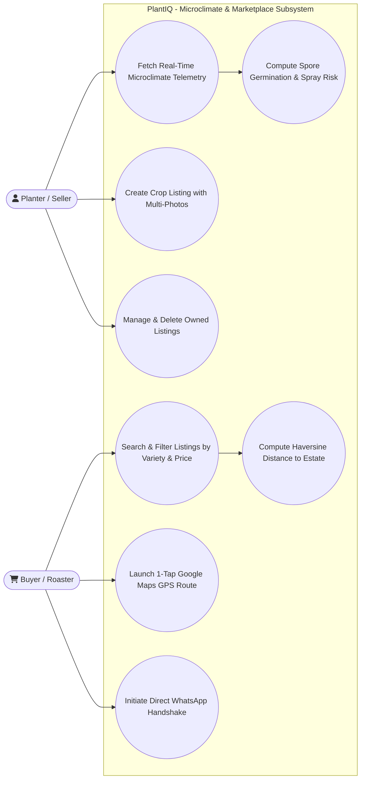
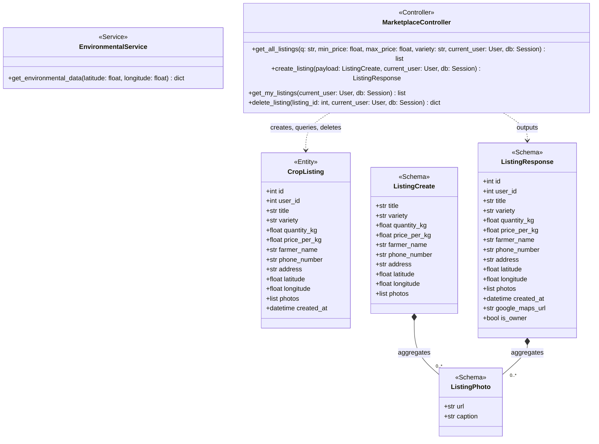
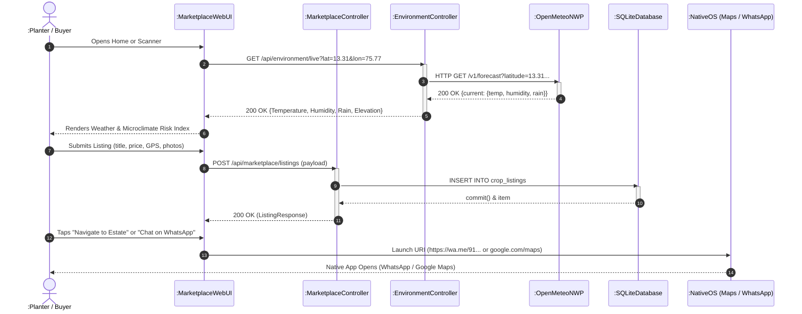

# Module 4: Precision Microclimate Risk Engine & Spatial Marketplace Module
## Section 3.5 of Low Level Design Document

[MODULE: Microclimate & Marketplace | SECTION: 3.5.1 Description | TYPE: Text]
Source: backend/app/services/env_service.py, backend/app/api/marketplace.py, backend/app/models/marketplace.py, docs/architecture/04_MICROCLIMATE_RISK_ENGINE.md, docs/architecture/05_MARKETPLACE_AND_SPATIAL_DISCOVERY.md

### 3.5.1 Description
The Precision Microclimate Risk Engine & Spatial Marketplace Module couples localized epidemiological weather analytics with direct peer-to-peer agricultural commodity commerce.

#### 1. Precision Microclimate & Epidemiological Risk Engine
Tropical foliar fungi (*Hemileia vastatrix*, *Cercospora coffeicola*, *Phoma costaricensis*) require strict microclimatic conditions to germinate urediniospores, develop germ tubes, and penetrate leaf stomata. The microclimate engine fusions device GPS coordinates with high-resolution numerical weather prediction (NWP) via the **Open-Meteo REST API** to retrieve real-time temperature ($T$ in $^\circ\text{C}$), relative humidity ($RH$ in $\%$), precipitation ($P$ in $\text{mm/hr}$), wind speed ($W$ in $\text{km/h}$), and Digital Elevation Model altitude ($\text{m a.s.l.}$).

The module calculates the biological Coffee Leaf Rust Spore Germination Index ($\mathcal{R}_{\text{rust}} \in [0.0, 1.0]$):
$$\mathcal{R}_{\text{rust}} = f_T(T) \times f_{RH}(RH) \times f_P(P)$$
Where:
- Optimal temperature response curve:
  $$f_T(T) = \exp\left(-\frac{(T - 23)^2}{2 \times 3.5^2}\right)$$
- Humidity gating:
  $$f_{RH}(RH) = \begin{cases} 1.0 & \text{if } RH \ge 85\% \\ \frac{RH - 60}{25} & \text{if } 60\% \le RH < 85\% \\ 0.0 & \text{if } RH < 60\% \end{cases}$$
- Rainfall / leaf wetness:
  $$f_P(P) = \min\left(1.0, \frac{P}{5.0}\right)$$

#### 2. Spatial Agricultural Marketplace
To eliminate middleman brokerage commissions and price exploitation, the module provides a direct farmer-to-buyer crop listing exchange. Planters publish lot-level listings containing coffee variety (`Arabica Selection 795`, `Robusta CXR`), harvest quantity, unit price per kg, contact numbers, GPS estate coordinates, and JSON-serialized multi-photo galleries with lot captions. The platform integrates:
- **Haversine Distance Geospatial Filtering**: Calculates transit distances between buyer roasteries and plantation farm gates.
- **Native Android OS Intent Bridges**: Dispatches direct WhatsApp business negotiation URIs (`https://wa.me/...`), Google Maps spatial navigation links (`https://www.google.com/maps/search/?api=1&query=lat,lon`), and telephony links (`tel:...`) via Capacitor 7 without triggering WebView errors.

---

[MODULE: Microclimate & Marketplace | SECTION: 3.5.2 Use Case Diagram | TYPE: Mermaid]
Source: backend/app/api/marketplace.py, backend/app/api/environment.py, frontend/static/js/marketplace.js, frontend/static/js/location.js



---

[MODULE: Microclimate & Marketplace | SECTION: 3.5.2 Use Case Table | TYPE: Table]
Source: backend/app/api/marketplace.py, backend/app/api/environment.py

| Use Case Item | Description |
| :--- | :--- |
| **Fetch Real-Time Microclimate Telemetry** | Queries Open-Meteo using device GPS coordinates to extract live temperature, humidity, rain, and elevation. |
| **Compute Spore Germination & Spray Risk** | Evaluates non-linear temperature, humidity, and leaf wetness functions to predict fungal outbreak risk. |
| **Create Crop Listing with Multi-Photos** | Planters post lot details, price, quantity, address, GPS coordinates, and multi-photo galleries with captions. |
| **Search & Filter Listings** | Buyers filter active listings by free-text keywords, variety strings, and dynamic min/max price sliders. |
| **Compute Haversine Distance** | Evaluates geodesic distance between buyer location and estate coordinates using spherical trigonometry. |
| **Launch 1-Tap Google Maps GPS Route** | Triggers Android OS intent opening Google Maps centered on the estate latitude/longitude coordinates. |
| **Initiate Direct WhatsApp Handshake** | Launches WhatsApp application pre-filling seller phone number and negotiated crop lot details. |
| **Manage & Delete Owned Listings** | Planters view their active listings and delete sold lots with server-side authorization enforcement. |

---

[MODULE: Microclimate & Marketplace | SECTION: 3.5.3 Class Diagram | TYPE: Mermaid]
Source: backend/app/models/marketplace.py, backend/app/schemas/marketplace.py, backend/app/services/env_service.py, backend/app/api/marketplace.py



---

[MODULE: Microclimate & Marketplace | SECTION: 3.5.3.1 Class Description - EnvironmentalService | TYPE: Text]
Source: backend/app/services/env_service.py:4-46

#### 3.5.3.1 Class Description: `EnvironmentalService`
`EnvironmentalService` is a singleton service responsible for querying external meteorological APIs and assembling localized environmental telemetry. When provided valid latitude and longitude coordinates, it queries the Open-Meteo Numerical Weather Prediction (NWP) API with a 3-second network timeout. It extracts ambient temperature, apparent temperature ("feels like"), relative humidity, rainfall precipitation, wind speed, Digital Elevation Model (DEM) altitude, and returns estimated soil pH. If GPS permissions are denied or network timeouts occur, it returns standard South Indian coffee belt agronomic baselines.

#### 3.5.3.2 Class Name: `EnvironmentalService`

#### 3.5.3.3 Data Members: `EnvironmentalService`
Source: backend/app/services/env_service.py

*`EnvironmentalService` is a stateless service class and does not maintain mutable instance variables.*

---

[MODULE: Microclimate & Marketplace | SECTION: 3.5.3.4 Method: EnvironmentalService.get_environmental_data | TYPE: Text]
Source: backend/app/services/env_service.py:5-42

#### 3.5.3.4 Method: `get_environmental_data(self, latitude: Optional[float] = None, longitude: Optional[float] = None) -> Dict[str, Any]`
- **Purpose**: Retrieves real-time atmospheric conditions and terrain elevation for given GPS coordinates from Open-Meteo, with deterministic agronomic fallback values.
- **Input**: `latitude` (`Optional[float]`), `longitude` (`Optional[float]`).
- **Output**: `Dict[str, Any]` containing location status, temperature, feels like, humidity, rainfall, wind speed, soil pH, and elevation.
- **Parameters**: `latitude`, `longitude`.
- **Exceptions**: Catches `requests.RequestException` and network timeouts, returning default coffee belt baseline dictionary.
- **Pseudo-code**:
```python
IF latitude IS NULL OR longitude IS NULL THEN
    RETURN {
        'location_status': 'Disallowed / Unavailable',
        'note': 'Operating with standard South Indian coffee belt agronomic baselines.'
    }
END IF

TRY
    SET url = "https://api.open-meteo.com/v1/forecast?latitude=" + latitude + "&longitude=" + longitude + "&current=temperature_2m,relative_humidity_2m,rain,wind_speed_10m,apparent_temperature&elevation=nan"
    SET res = CALL requests.get(url, timeout=3)
    IF res.status_code == 200 THEN
        SET data = res.json()
        SET current = data.get('current', {})
        SET elevation_val = data.get('elevation', 980.0)
        RETURN {
            'location_status': 'Active GPS Location',
            'Coordinates': STRING(latitude) + ", " + STRING(longitude),
            'Temperature (°C)': current.get('temperature_2m', 24.5),
            'Feels Like (°C)': current.get('apparent_temperature', 25.0),
            'Humidity (%)': current.get('relative_humidity_2m', 78.0),
            'Rainfall (mm)': current.get('rain', 0.0),
            'Wind Speed (km/h)': current.get('wind_speed_10m', 12.0),
            'Soil pH (estimated)': 6.2,
            'Elevation (m)': elevation_val
        }
    END IF
CATCH Exception AS e:
    LOG "Open-Meteo Warning: " + e
END TRY

RETURN {
    'location_status': 'Active GPS Location (Fallback Weather)',
    'Coordinates': STRING(latitude) + ", " + STRING(longitude),
    'Temperature (°C)': 23.5,
    'Feels Like (°C)': 24.5,
    'Humidity (%)': 82.0,
    'Rainfall (mm)': 5.0,
    'Wind Speed (km/h)': 10.0,
    'Soil pH': 6.2,
    'Elevation (m)': 980.0
}
```

---

[MODULE: Microclimate & Marketplace | SECTION: 3.5.3.5 Class Description - CropListing | TYPE: Text]
Source: backend/app/models/marketplace.py:5-20

#### 3.5.3.5 Class Description: `CropListing`
`CropListing` is a declarative SQLAlchemy ORM model representing a physical coffee harvest lot listed for direct sale on the peer-to-peer marketplace. It stores commodity title, cultivar variety, harvest quantity in kilograms, price per kilogram in Indian Rupees (INR), planter name, telephone contact, physical estate address, geospatial GPS coordinates (latitude, longitude), and a serialized JSON list of photo gallery objects with captions.

#### 3.5.3.6 Class Name: `CropListing`

#### 3.5.3.7 Data Members: `CropListing`
Source: backend/app/models/marketplace.py:7-20

| Data Type | Data Name | Access Modifiers | Initial Value | Description |
| :--- | :--- | :--- | :--- | :--- |
| `Integer` | `id` | Public (`+`) | Auto-increment Primary Key | Unique relational identifier for the marketplace listing. |
| `Integer` | `user_id` | Public (`+`) | None (Nullable, Indexed) | User ID of the planter publishing the listing (foreign key to `users.id`). |
| `String` | `title` | Public (`+`) | None (Not Null) | Heading title describing the lot (e.g., "Parchment Arabica Washed"). |
| `String` | `variety` | Public (`+`) | None (Not Null) | Cultivar name (e.g., "Arabica Selection 795", "Robusta CXR"). |
| `Float` | `quantity_kg` | Public (`+`) | None (Not Null) | Total available stock volume in kilograms. |
| `Float` | `price_per_kg` | Public (`+`) | None (Not Null) | Unit asking price in Indian Rupees (INR) per kilogram. |
| `String` | `farmer_name` | Public (`+`) | None (Not Null) | Contact name of the estate owner or manager. |
| `String` | `phone_number` | Public (`+`) | None (Not Null) | Direct telephone / WhatsApp contact number. |
| `String` | `address` | Public (`+`) | None (Not Null) | Physical estate address and landmark. |
| `Float` | `latitude` | Public (`+`) | None (Nullable) | GPS latitude coordinate for Google Maps spatial navigation. |
| `Float` | `longitude` | Public (`+`) | None (Nullable) | GPS longitude coordinate for Google Maps spatial navigation. |
| `JSON` | `photos` | Public (`+`) | None (Nullable) | JSON array of photo objects: `[{"url": "...", "caption": "..."}]`. |
| `DateTime` | `created_at` | Public (`+`) | `datetime.utcnow` | Timestamp indicating when the listing was posted. |

---

[MODULE: Microclimate & Marketplace | SECTION: 3.5.3.8 Controller Methods - marketplace | TYPE: Text]
Source: backend/app/api/marketplace.py:12-102

#### 3.5.3.8 Controller Methods: `api/marketplace.py`

##### Function 1: `get_all_listings(q: Optional[str] = Query(None), min_price: Optional[float] = Query(None), max_price: Optional[float] = Query(None), variety: Optional[str] = Query(None), current_user: Optional[User] = Depends(get_current_user_optional), db: Session = Depends(get_db)) -> List[ListingResponse]`
- **Purpose**: Queries `CropListing` records with multi-criteria dynamic filtering across title/variety/address/name, price bounds, and variety substrings.
- **Input**: Optional query string `q`, optional price filters `min_price` and `max_price`, optional cultivar `variety`, optional user authentication token, database session `db`.
- **Output**: List of `ListingResponse` schemas serialized with ownership flags and Google Maps URL links.
- **Parameters**:
  - `q` (`Optional[str]`, default `None`): Free-text search term matched against title, variety, address, and farmer name.
  - `min_price` (`Optional[float]`, default `None`): Lower price filter bound (INR/kg).
  - `max_price` (`Optional[float]`, default `None`): Upper price filter bound (INR/kg).
  - `variety` (`Optional[str]`, default `None`): Specific cultivar filter string (e.g. `'Arabica'`).
  - `current_user` (`Optional[User]`, default `None`): Authenticated user entity if Bearer token provided.
  - `db` (`Session`): Active SQLAlchemy relational database session.
- **Exceptions**: `SQLAlchemyError` on database query execution failure.
- **Pseudo-code**:
```python
SET query = db.query(CropListing)
IF q IS NOT EMPTY THEN
    SET term = "%" + LOWER(TRIM(q)) + "%"
    SET query = query.filter(CropListing.title.ilike(term) | CropListing.variety.ilike(term) | CropListing.address.ilike(term) | CropListing.farmer_name.ilike(term))
END IF
IF min_price IS NOT NULL THEN
    SET query = query.filter(CropListing.price_per_kg >= min_price)
END IF
IF max_price IS NOT NULL THEN
    SET query = query.filter(CropListing.price_per_kg <= max_price)
END IF
IF variety IS NOT EMPTY THEN
    SET query = query.filter(CropListing.variety.ilike("%" + variety.strip() + "%"))
END IF
SET items = query.order_by(CropListing.created_at.desc()).all()
RETURN [format_listing_response(item, current_user.id IF current_user ELSE None) FOR item IN items]
```

##### Function 2: `create_listing(payload: ListingCreate, current_user: Optional[User] = Depends(get_current_user_optional), db: Session = Depends(get_db)) -> ListingResponse`
- **Purpose**: Creates and persists a new `CropListing` record in the database with multi-photo gallery attachments and GPS coordinates.
- **Input**: Validated `ListingCreate` payload, optional authenticated user, active database session `db`.
- **Output**: Persisted `ListingResponse` schema containing the assigned primary key ID.
- **Parameters**:
  - `payload` (`ListingCreate`): Validated request schema containing title, variety, quantity_kg, price_per_kg, farmer_name, phone_number, address, latitude, longitude, and photo list.
  - `current_user` (`Optional[User]`, default `None`): Authenticated user entity if Bearer token present.
  - `db` (`Session`): Active SQLAlchemy relational database session.
- **Exceptions**: `RequestValidationError` on malformed schema inputs; `SQLAlchemyError` on insert transaction failure.
- **Pseudo-code**:
```python
SET user_id = current_user.id IF current_user ELSE None
SET photos_data = [p.dict() FOR p IN payload.photos]
SET item = NEW CropListing(
    user_id=user_id, title=payload.title, variety=payload.variety,
    quantity_kg=payload.quantity_kg, price_per_kg=payload.price_per_kg,
    farmer_name=payload.farmer_name, phone_number=payload.phone_number,
    address=payload.address, latitude=payload.latitude, longitude=payload.longitude,
    photos=photos_data
)
CALL db.add(item)
CALL db.commit()
CALL db.refresh(item)
RETURN format_listing_response(item, user_id)
```

##### Function 3: `delete_listing(listing_id: int, current_user: Optional[User] = Depends(get_current_user_optional), db: Session = Depends(get_db)) -> dict`
- **Purpose**: Deletes an existing listing from the database, enforcing strict ownership authorization.
- **Input**: Integer listing ID `listing_id`, optional authenticated user `current_user`, active database session `db`.
- **Output**: Confirmation dictionary `{"message": "Listing deleted successfully"}`.
- **Parameters**:
  - `listing_id` (`int`): Primary key identifier of the listing to delete.
  - `current_user` (`Optional[User]`, default `None`): Authenticated user entity requesting deletion.
  - `db` (`Session`): Active SQLAlchemy relational database session.
- **Exceptions**:
  - `HTTPException(404)`: Raised when the target `listing_id` does not exist.
  - `HTTPException(403)`: Raised when the requesting user is not the owner of the listing.
  - `SQLAlchemyError`: Raised on database transaction or delete failure.
- **Pseudo-code**:
```python
SET item = db.query(CropListing).filter(CropListing.id == listing_id).first()
IF item IS NULL THEN
    RAISE HTTPException(404, "Listing not found")
END IF
IF current_user AND item.user_id != current_user.id THEN
    RAISE HTTPException(403, "Not authorized to delete this listing")
END IF
CALL db.delete(item)
CALL db.commit()
RETURN {"message": "Listing deleted successfully"}
```

---

[MODULE: Microclimate & Marketplace | SECTION: 3.5.4 Sequence Diagram | TYPE: Mermaid]
Source: backend/app/api/marketplace.py, backend/app/api/environment.py, frontend/static/js/marketplace.js


